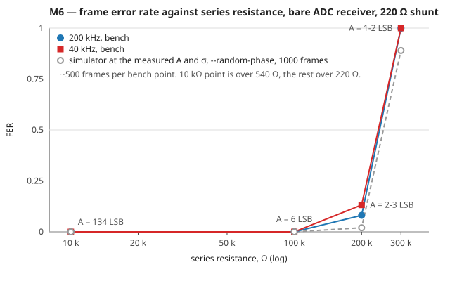

# Handoff — Development Plan

Rev 1.0. Companion to [body-coupled-handshake-design.md](body-coupled-handshake-design.md).

That document says *what* to build. This one says *in what order*, and *how each
piece is proven* before the next one starts.

---

## 1. Principle

Design §14.2 gives a five-step bring-up sequence. Every one of its steps needs
two finished wristbands. That is the wrong shape for a project whose analogue
parts have not arrived: it leaves everything untested until everything exists,
and when the first end-to-end test fails there are twelve candidate causes.

This plan reorders around one rule:

> **Every milestone must be falsifiable with the hardware already on the desk.**
> Hardware is added only when a milestone genuinely cannot proceed without it.

The consequence is that most of the firmware — modulation, framing, timing
recovery, packet protocol, contact trigger — is written and proven with **no
hardware at all**, on the host PC. What is left for the board is only what the
board alone can answer: does the ADC keep up, does the amplifier have the gain
the link budget assumed, does a body actually carry the signal.

Two supporting rules:

- **One new variable per milestone.** If a step adds both a new circuit and a
  new firmware feature, split it.
- **Every hardware failure becomes a host test.** Any capture that broke the
  decoder on the bench is saved into `firmware/test/vectors/` and replayed in
  CI forever. The bug is not fixed until it is a regression test.

---

## 2. The testable units

This is the structural answer. The project is split so that the layers which can
be tested without hardware are physically unable to depend on hardware.

| Layer | Contents | Tested by | Hardware |
|---|---|---|---|
| `lib/dsp` | Goertzel, chip integration, threshold and timing recovery | host unit tests + channel simulator | none |
| `lib/link` | Manchester encode/decode, preamble sync, framing, CRC | host unit tests + golden vectors | none |
| `lib/proto` | Contact trigger, stop-and-wait, turnaround timing | host tests, two simulated nodes in one process | none |
| `lib/record` | 40-byte contact record codec, vCard mapping | host unit tests | none |
| `lib/hal` | the interface only — no code, implemented twice | compiles everywhere | none |
| `lib/hal_pico` | PIO carrier, ADC + DMA ring, pad high-Z, BLE, flash | on-board self-test apps | board |
| `apps/*` | Flashable images, one per milestone | the milestone itself | varies |
| `android/` | Native Android app — pairing, provisioning, receive, history, contacts | manual test against a fake record, then the real link | Pico + phone |
| `tools/` | Vector generator, plotter, capture replay | used by the tests | none |

**The enforcing rule:** nothing under `lib/dsp`, `lib/link`, `lib/proto` or
`lib/record` may `#include` a Pico SDK header. They see plain arrays of `int16_t`
samples and plain byte buffers. CI compiles them with host `gcc -Wall -Werror`,
which fails loudly the moment someone reaches for `hardware/adc.h`.

That single constraint is what makes M1 possible, and M1 is what makes every
later milestone cheap.

### 2.1 Layout

Abbreviated. The complete tree, every module interface, and the rule that all of
it is created before M1 ends are in
**[firmware-architecture.md](firmware-architecture.md)**.

```
firmware/
  apps/
    blink/          M0  board + toolchain + USB console            [done]
    txgen/          M3  carrier generation and self-measurement
    adcbench/       M4  500 ksps DMA ring + Goertzel timing budget
    loopback/       M5  whole link inside one chip
    linktest/       M6+ one-way link; TX or RX chosen at boot
    afe_sweep/      M7  analogue front-end characterisation instrument
    handoff/        M14 the real thing
  lib/
    dsp/  link/  proto/  record/       host-testable, no SDK headers
    hal/                               the seam: interface only
    hal_pico/                          RP2350 binding
  test/
    host/           unit tests + channel simulator, built with host gcc
    vectors/        golden vectors (generated) + captures (from hardware)
tools/
  gen_vectors.py    generates waveforms from the spec, independently of the C
  plot.py           host plotter for score / raw-ADC streams
  replay.py         feeds a hardware capture back through the host decoder
android/            native Android app (own project, not built by the Pico SDK)
```

---

## 3. Milestone ladder

| # | Milestone | Hardware added | Running total |
|---|---|---|---|
| M0 | Board, toolchain, USB console | Pico 2 W | 1 Pico ✅ |
| M1 | DSP + protocol library, host tested | **none** | 1 Pico ✅ |
| M2 | BLE → phone → contact in address book | phone (have it) | 1 Pico + phone ✅ |
| M3 | Carrier generation, self-measured | none | 〃 |
| M4 | ADC at 500 ksps + Goertzel real-time budget | none | 〃 |
| M5 | Full link, single board, one jumper wire | 1 wire, then 2 resistors | 〃 |
| M6 | Two boards, wired channel | 2nd board + 2 resistors | 2 boards |
| M7 | Analogue front end characterised on the bench | AFE parts | + AFE |
| M8 | Link through the AFE, capacitor as fake body | 1 small capacitor | 〃 |
| M9 | Two boards, plate coupling, no body | copper clad electrodes | + electrodes |
| M10 | **Body coupling, one way, 40 kHz → 200 kHz** | a person | 〃 |
| M11 | Validation campaign §14.1 | battery + isolation | + LiPo / TP4056 |
| M12 | Body → BLE → phone, end to end, one way | none | 〃 |
| M13 | Half-duplex turnaround on one board | none | 〃 |
| M14 | Contact trigger, two-way handshake | none | 2 wristbands |

### 3.1 Mapping to your version

| You said | Here |
|---|---|
| "pico2w and android phone, so that interface i can test" | **M2** — and it is genuinely independent, run it in parallel with anything |
| "tx part with no external circuits, loop back to an adc pin" | **M5** — with M3 and M4 split out first, because a failed loopback otherwise has two possible causes |
| "when hardware arrives, add analog circuits, loop back again" | **M7 / M8** — with M7 characterising the amplifier *before* it goes in the loop |
| "two separate devices as tx and rx" | **M9 / M10** — but M6 gets you two devices much earlier, over a wire |
| "both being tx and rx with negotiation" | **M13 / M14** — though the negotiation logic itself is tested at **M1**, in a simulator, before any of this |

The two things worth adding to your sequence: the **host test layer (M1)** ahead
of everything, and a **wired two-board link (M6)** before the analogue parts
arrive. M6 in particular is the only cheap way to test two independent crystals,
which loopback structurally cannot do.

---

## 4. Milestones in detail

Each milestone states what it proves and — just as important — what it
**cannot** prove, so no false confidence is carried forward.

### M1 — DSP and protocol library, host tested

**Hardware: none.** This is the largest single milestone and it needs nothing.

Build:

- `tools/gen_vectors.py` — generates modulated waveforms **from the spec**, not
  from the C encoder. This matters: if the C encoder and C decoder share a
  misreading of §9.4, a loopback test passes and the link still fails. An
  independent generator is the only thing that catches that class of bug.
- A channel simulator with knobs for attenuation, additive noise, carrier
  frequency offset, sample-clock offset, DC drift, amplitude ramp (the "grip
  changes mid-packet" case), mains hum, and burst dropouts.
- Unit tests for Goertzel magnitude, chip integration, Manchester decision,
  preamble sync, frame extraction, CRC, record codec.
- A BER harness that sweeps SNR and prints a curve.

Exit criteria:

- BER < 1e-4 at the SNR the link budget predicts, with 6 dB of margin.
- Packet decodes correctly with a 20 dB amplitude ramp across the packet.
- Packet decodes correctly at ±200 ppm carrier offset (4× worse than two real
  crystals) and ±200 ppm chip-clock offset.
- CI runs the whole suite on push.

Cannot prove: anything about the ADC, the analogue chain, or the body.

**Spec questions this milestone must close.** Each is cheap here and expensive
later:

1. **The sync rule.** §9.4's preamble is 32 alternating chips. Under Manchester,
   alternating chips are indistinguishable from a run of identical bits, so the
   preamble is chip-phase ambiguous by construction — which is what the start
   marker is for. Encoding `11110000` gives chips `1010101001010101`; the only
   feature that cannot occur in the preamble is the `00` at the bit-4/bit-5
   boundary. So the detector is: lock to the alternating run, then declare the
   payload boundary at the first chip-pair violation. Write it down, test it,
   and test it against a preamble corrupted at the last chip.
2. **Goertzel N.** N = 50 gives 100 µs windows — 5 per chip, so chip alignment
   can never be better than 20 % of a chip. N = 25 halves that error and costs
   3 dB of processing gain (the carrier stays on a bin centre either way:
   200 kHz is bin 10 of 20 kHz). Sweep both in the simulator and choose with a
   number, not an argument.
3. **CRC width.** CRC-8 lets roughly 1 in 256 corrupted packets through. On a
   marginal link that is a visibly wrong name in someone's address book. CRC-16
   costs one byte and about 8 ms of airtime. Recommendation: **CRC-16**. If
   CRC-8 is kept, require two consecutive identical passing packets instead —
   but that roughly halves the odds inside a one-second handshake.
4. **The vCard codec and fragmentation** — see
   [firmware-architecture.md §8](firmware-architecture.md). This replaces the
   40-byte record entirely and is now the single largest piece of M1: compact
   TLV encoding, fragment header, reassembly bitmap, and the priority carousel.
   Purely host-side work, and it blocks M2. Sweep the fragment payload size and
   the carousel weighting here rather than guessing them.
   Cross-check the C codec against `tools/vcf.py` in both directions — same
   independent-implementation discipline as the modulation vectors.

### M2 — Phone link — **verified 11 Sep 2026, all six criteria**

**Hardware: Pico 2 W + your Android phone. Nothing else. Fully parallel — start
it today.**

> **The phone client is a native Android app** — see
> [firmware-architecture.md §11](firmware-architecture.md). The BLE GATT contract
> (§11.2) is fixed, so the firmware side of this milestone is independent of the
> app and can proceed now.

Firmware: BLE peripheral implementing the §11.2 contract — `my_vcard` write for
provisioning, `rx_vcard` notify with a hardcoded fake vCard, `status`,
`telemetry`, `control`, with `my_vcard` / `rx_vcard` requiring a bonded encrypted
link. Plus flash persistence, so the wristband remembers its own card across
power cycles.

App: a skeleton of the `android/` project — pair via `CompanionDeviceManager`,
hold the connection in a foreground service, write a provisioning vCard, receive
`rx_vcard` into a local database, and promote one entry into the system address
book via a `ContactsContract.Intents.Insert` intent.

Exit criteria:

- A fake vCard travels `rx_vcard` → app database → system address book, end to
  end, on your phone.
- Provisioning round-trips: write your own card from the app, power-cycle the
  Pico, read it back unchanged.
- Provisioning from a contact picked out of the phone's address book
  (`READ_CONTACTS`, per-field preview) produces the same round-trip.
- Chunked reassembly works at the 23-byte ATT MTU floor, not just at whatever
  MTU your phone happens to negotiate.
- The foreground service catches an `rx_vcard` notify with the screen off and
  the app backgrounded — the case a web client could not have handled.
- Bonding holds across a Pico power-cycle: the app reconnects without a fresh
  OS pairing dialog.

Cannot prove: anything about the body link.

**What M2 built, and where.**

| Piece | Where |
|---|---|
| GATT service, five characteristics, LE Secure Connections bonding | `firmware/lib/hal_pico/ble.c`, `ble_service.gatt`, `btstack_config.h` |
| `seq \| total` chunking, host-tested at every capacity from the ATT floor up | `firmware/lib/link/chunk.c`, `test/host/test_chunk.c` |
| Record persistence, and the seam that keeps `store.c` host-testable | `firmware/lib/hal_pico/flash.c`, `lib/record/store.c`, `test/host/test_store.c` |
| Decimated score stream, for the §13 body tests | `firmware/lib/hal_pico/tlm_ble.c` |
| The flashable image, with the fake card | `firmware/apps/handoff` |
| Pairing, foreground service, history database, contact promotion | `android/` |

**Two things M2 found that reading would not have.**

1. **The record must not go in the last flash sector**, which is what
   `flash.h` originally said. On RP2350 the SDK reserves the final sector for
   the E10 erratum workaround, and BTstack's bond storage takes the two below
   it — so "the last sector" would have erased the phone bond every time the
   wearer re-provisioned their card. It is the fourth from the end, and
   `flash.c` static-asserts that against `PICO_FLASH_BANK_STORAGE_OFFSET`
   rather than trusting a comment. This would not have failed at build time or
   at first boot.

2. **The chunk framing had to move out of `ble.c`.** Nothing under `hal_pico/`
   can be compiled by the host build, so framing that lived there could only be
   tested with a board and a phone in hand — against an exit criterion that is
   specifically about the case a developer's own handset does not exercise. It
   is now `lib/link/chunk.c`, tested at every capacity from 20 bytes to 244,
   and the Android side runs the same cases against its own implementation.
   See [firmware-architecture.md §13.2](firmware-architecture.md).

**Verified, on a OnePlus CPH2569 running Android 15.**

| Criterion | Measured |
|---|---|
| Fake card → app DB → address book | contact 6475 "Björn Smári" in the contacts provider, org, phone and email intact |
| Provision, power-cycle, read back | banner `provisioned: 82 compact bytes, record id 1` after a true power cycle; the flash backend CRC-16-checks header and blob on load |
| From the contact picker | per-field preview, a field deselected; `61 compact bytes, record id 2` after reboot |
| 23-byte floor | band sent at `ATT MTU 23` — ten 18-byte chunks — and every one of six received cards is byte-identical to the firmware constant |
| Screen off, app backgrounded | card sent at 07:10:34 with the phone dozing and the launcher resumed landed in the database |
| Bond across a power cycle | reconnected 1.5 s after the port came back, re-encrypted from the stored bond, no SMP, no dialog |

**What running it found.** None of these would have been found by reading;
three of them made the first criterion fail outright.

1. **The main loop must not touch the CYW43 while Bluetooth is up.** The
   original image polled the LED through the CYW43 every 50 ms and sent the
   fake card from the main loop under the async-context lock. Traced with a
   heartbeat: either call parked the core until the *next Bluetooth
   interrupt* — 40 s at a time. A card armed for +10 s went out only when the
   phone next wrote to the band. The send is now a BTstack timer, the LED is
   written from `ble.c`'s connection events, and `main()` only sleeps. M12's
   DSP loop inherits that rule; it is in the comment above `main()`.
2. **Android 15 does not pair on the band's `Insufficient Encryption`
   reply.** The rx_vcard CCCD write got the error, no pairing started, no
   callback fired, and the operation queue stalled forever. The app now calls
   `createBond()` explicitly before subscribing.
3. **`CompanionDeviceManager` hands back a lowercase MAC**, and
   `getRemoteDevice` throws on it. The service crashed the instant it
   connected, taking the not-yet-flushed stored address with it.
4. **`status` never reached the phone.** It was notified from inside the
   write callbacks, where BTstack's outgoing buffer is reserved for the write
   response, and the "drop it, the next one carries the same state" comment
   was wrong: there was no next one. It is deferred to can-send-now now,
   behind any vCard chunk in flight.
5. **`close()` does not drop the ACL.** The MTU-floor toggle rebuilt the GATT
   client, the new one rode the still-open link, and the band still saw
   MTU 255 — the exact way criterion 4 could have passed by accident.
   `BandClient.close()` disconnects first and the service waits for the link
   to go.
6. **The Pico's BLE transmit is weak.** The phone heard a −90 dBm device
   across the room and not the band at desk distance; at 10 cm the band was
   −30 dBm. A diagnostic *Scan* button (unfiltered, logs what it hears) is
   what settled that, and it stays in the app. Worth measuring properly
   before anyone wears one.

**Not built, deliberately.** The "auto-save new handshakes to Contacts"
setting of [architecture §11.3](firmware-architecture.md) is off by default and
is not implemented: it is the only thing that would need `WRITE_CONTACTS`, and
the app does not declare that permission at all until somebody asks for the
setting. Promotion goes through the system contact editor, which needs nothing.

### M3 — Carrier generation — **verified 11 Sep 2026, all four criteria**

**Hardware: none.**

PIO state machine on GP2, dividers for 40 kHz and 200 kHz; OOK gating; Manchester
chip stream driven from the M1 library; GP2 forced to high-Z on demand (§6.3).

Self-measurement with zero external hardware: a second PIO state machine can
read the pin state of GP2 and count edges over a gate interval — the PIO input
mux is independent of whichever peripheral drives the pad, so **no jumper is
needed**. Print measured Hz over USB.

Exit criteria:

- Measured carrier within 0.1 % of 40 000 Hz and 200 000 Hz.
- Chip timing jitter under 1 µs against a 500 µs chip.
- Gating on and off is chip-aligned, verified by counting edges per chip window.
- GP2 reads as high-Z when told to be (see RP2350-E9 in §6 below).

Cannot prove: signal amplitude, or anything about the receive side.

**Verified, with `apps/txgen` and nothing on the board.**

| Criterion | Measured |
|---|---|
| Carrier within 0.1 % | 200 005 Hz and 39 995 Hz — 25 ppm and 125 ppm |
| Chip jitter under 1 µs | 250 000 ns chips, no measurable jitter |
| Gating chip-aligned | edge counts per chip window exactly as expected |
| GP2 high-Z on demand | the pad follows an internal pull, so nothing else is driving it |

**What running it found.** RP2350-E9 is real and §6's guess about it was
wrong. Once a high-impedance bank-0 pad has been taken high it latches, and
the internal pull-down — far stronger than R1's 1 MΩ — cannot bring it back.
A latched pad is driving the electrode that §6.3 requires it to stop loading.
Toggling the pad's input buffer clears it, confirmed both ways, and that is
what `pio_carrier_drive(false)` does on the way into receive.

### M4 — ADC and the real-time budget — **verified 14 Sep 2026, all four criteria**

**Hardware: none** (GP26 unconnected — see finding 2 for why not a rail).

Free-running ADC0 at `adc_set_clkdiv(0)` → 48 MHz / 96 = 500.000 ksps exactly,
DMA into a ring buffer, Goertzel loop on core 1, score stream out over USB.

This closes design §17's second open item — *"500 ksps ADC + DMA + Goertzel
timing on core 1: not verified. If this does not hold, the analogue mixer must be
reinstated."* The arithmetic says it will hold comfortably: 500 k samples/s
against a 150 MHz core is 300 cycles per sample, and a Goertzel inner iteration
is single-digit cycles — order 2–5 % core load. **The risk is not the maths, it
is DMA and interrupt handling and ring-buffer overrun.** Instrument for that
specifically.

Exit criteria:

- Measured sample rate within 0.01 % of 500 ksps, timed over 60 s.
- Zero dropped DMA blocks in 10 minutes, with a counter proving it.
- Core-1 loop headroom printed as a percentage.
- Noise floor of the bare ADC recorded in LSB RMS. This is the reference every
  later amplitude measurement is compared against.

Also settle the **instrumentation format** here, because §10.5 and §13 are in
tension: raw ADC is 1 MB/s, which full-speed USB CDC cannot sustain, and §13
forbids tethering to a mains-powered laptop while anyone touches an electrode.
Resolution:

- **Score stream** (10 000 × 16-bit/s = 20 kB/s) is the *continuous* telemetry,
  and it is what every §14.1 plot actually needs. Cheap enough for USB, and
  decimated it fits over BLE for the body tests where USB is forbidden.
- **Raw ADC** is a *triggered burst*: capture 100 ms into RAM (100 kB), then dump
  at leisure. Never continuous.

**Verified, with `apps/adcbench`, GP26 unconnected.**

| Criterion | Measured |
|---|---|
| Rate within 0.01 % | 499 999 sps over the 600 s soak (2 ppm); 499 984 at 60 s, where one 2048-sample block is 68 ppm of quantisation |
| Zero dropped DMA blocks in 10 min | 0, from the counter in the DMA interrupt; 0 chips dropped between the cores; 11 999 969 windows scored |
| Core-1 headroom | **68.3 %** at `-Og` (the default Debug build), **75.1 %** at `-O3` (Release); zero drops in both |
| Bare-ADC noise floor | **0.6–1.0 LSB RMS** across runs (12-bit, one 2048-sample block, mean code 870, on-die temperature sensor as the source) |

The rate figure is honest but limited: the ADC clock and the timer both come
off the same 12 MHz crystal, so this measurement can only catch a wrong
divider or lost samples, never absolute accuracy. That is what M6's
independent clocks are for.

**What running it found.**

1. **The image that was left on the board on 11 Sep was hanging inside the
   DMA restart, and it was an RP2350 difference.** `adc_ring_stop()` aborts a
   channel mid-block and `adc_ring_start()` restarted it without touching its
   write address. On RP2040 the residual count would have ended at the block
   boundary. On RP2350 `TRANS_COUNT` is a *reload* value, so the aborted
   channel restarted with a full 2048-sample count from a pointer partway
   through its block and DMA'd up to 4 kB of samples past the end of the ring
   — over the flags and `s_dma[]` itself. With the channel numbers corrupted
   the interrupt handler cleared the wrong bit, DMA_IRQ_0 stormed, the
   low-priority USB worker never ran again, and the board sat enumerated,
   silent, and unreachable by `picotool -f`. Found by a phased heartbeat that
   died with no core 1 and no DSP running, which left only the ring. Every
   channel is now re-armed from the top of its block in `start()`.
2. **The noise floor cannot be taken at a rail.** This section said "input
   left at ground or 3V3", and at ground the ADC returns 0 for every sample:
   one side of the noise is clipped and the RMS reads 0.0. Enabling the pad's
   pull-up and pull-down together does not give mid-scale either — on RP2
   that is a bus keeper, and it held the pin at the ground it had last seen
   (code 64). The on-die temperature sensor is a quiet ~0.7 V diode on the
   same converter, needs no parts, and is what the figure above is taken on.
3. **Core 1 is 32 % busy at `-Og` and 25 % at `-O3`, not the 2–5 % this section predicted.** The
   arithmetic was for the Goertzel recurrence alone. What actually runs per
   window is `gz_isqrt64` — Newton iterations with a 64-bit division each —
   plus the 64-bit normalisation divide, and per sample the DC-centring copy.
   Comfortable, but it is the number M12 has to budget symbol sync and
   carrier detection against, and it says where to look first if that
   budget gets tight: the square root is only there to make scores linear
   in amplitude, and thresholds could as easily live in the magnitude-squared
   domain.
4. **The 60 s check printed 3 015 times.** `if (secs == RATE_SECONDS)` was
   true for a whole second of loop iterations. A flag, now.

### M5 — Loopback inside one board — **verified 14 Sep 2026, all four criteria**

**Hardware: one jumper wire. Then two resistors.**

*Phase A — bare wire, GP2 → GP26.* A 0–3.3 V square straight into the ADC. Safe
(the ADC's range is exactly 0–3.3 V) but it is a ~2000 LSB signal where the link
budget expects ~200 LSB, so it proves plumbing, not margin.

*Phase B — attenuator.* 10 kΩ from GP2 to the ADC node, 680 Ω from that node to
ground. That gives ~210 mV p-p — matching the ~160 mV the link budget expects at
the ADC — with a 640 Ω source impedance the SAR is happy to drive. Two resistors
from the kit, and no bias network is needed: the GPIO square is unipolar, so it
sits happily near the bottom rail.

Exit criteria:

- 40-byte packet passes CRC across the loop, at 40 kHz and at 200 kHz.
- 1000 consecutive packets, zero failures, at Phase B amplitude.
- BER measured as the attenuator is made progressively harsher, and the curve
  agrees with the M1 simulator's prediction to within a few dB. **Agreement
  between bench and simulator is the real deliverable here** — it is what lets
  you trust the simulator for everything afterwards.
- TX-off leakage: with GP2 high-Z, the received score drops to the M4 noise
  floor.

Cannot prove — and these matter:

- **Independent clocks.** Both PLLs derive from the same 12 MHz crystal, so TX
  and RX are perfectly coherent. Real crystals differ by tens of ppm. (For
  scale: ±60 ppm is ±12 Hz on a 10 kHz-wide Goertzel bin, and 21 µs of drift
  across a 350 ms packet against a 500 µs chip — both negligible. Worth
  confirming rather than assuming, which is what M6 does.)
- **Shared-bug cancellation.** Encoder and decoder are the same codebase, so a
  shared misreading of the spec cancels out. This is exactly why M1's
  independently generated vectors exist. Run them here too.
- Amplifier saturation and recovery, real noise, real interference.

**Verified, with `apps/loopback`, one wire and then two resistors.** The
attenuator was 10 kΩ over 2 × 270 Ω = 540 Ω rather than 680 Ω, which lands
169 mV — closer to §5's 160 mV than the plan's own figure. The harsher
points used 100 kΩ and 160 kΩ on top over 220 Ω, because with a 0.7 LSB
noise floor the cliff is at about 2 LSB of received fundamental and a 10 kΩ
divider cannot get within 30 dB of it.

| Criterion | Measured |
|---|---|
| Frame passes CRC at both carriers | Phase A and Phase B, 200 kHz and 40 kHz, 0 bit errors, 158 ms |
| 1000 consecutive frames at Phase B | **1000/1000**, 0 DMA overruns, 0 false syncs, 132 LSB, margin 132 |
| BER curve agrees with the simulator | bench cliff within ~2 dB of the model's, three points, table below |
| GP2 high-Z at the M4 floor | 0.0 LSB chip energy, raw 0.7 LSB RMS about code 6 — identical to driven-low |

The received amplitude is a free sanity check of the whole chain: a 0–3.3 V
square has a fundamental of 2·4095/π = 2607 LSB and the Goertzel read 2604 at
40 kHz; at Phase B, 2/π × 210 = 134 predicted, 132 read.

The curve, at 200 kHz. *A* is the received fundamental in LSB (float, from a
raw capture; the board's integer score reads ~0.4 lower), σ the raw-sample
RMS in silence. The simulator column is `handoff_ber --random-phase
--amplitude A --noise σ`, 1000 frames.

| Divider | A | σ | bench FER | simulator FER |
|---|---|---|---|---|
| 10 kΩ / 540 Ω | 132 | 0.7 | 0 / 1000 | 0 |
| 100 kΩ / 220 Ω | 3.5 | 1.1 | 0 / 200 | 0.17 |
| 160 kΩ / 220 Ω | 2.0 | 1.0 | 0.97 | 0.70 (1.00 at 1.5) |

**What running it found.** Six things, two of them bugs.

1. **The preamble slicer froze after a loud transient, and the receiver was
   deaf until re-initialised.** The board lost 200/200 frames at 3.9 LSB
   while `handoff_decode` decoded the identical capture; the difference was
   history. `frame.c`'s slicer decayed `hi` by `(hi - lo) >> 6`, which is
   zero once the gap is under 64, so after the wire was moved with the board
   live, `hi` sat at `lo + 63` and every 3 LSB chip sliced as a space. The
   simulator never saw it because ber.c re-initialises per frame; the
   design amplitude never saw it because 63 LSB is nothing under a 200 LSB
   signal. A wristband is a continuously listening receiver at whatever
   amplitude the grip gives, so it would have seen it — a firm grip followed
   by a light one. Every slicer step is now at least one LSB; `test_frame`
   pins it, and the capture is `captures/m5-100k-3lsb-slicer.s16`. With the
   fix the same point went 200/200.
2. **Below ~10 LSB the link is quantisation-limited, and SNR is the wrong
   axis.** At the same SNR the simulator gives FER 0 with a 200 LSB carrier
   and FER 0.6 with a 2.35 LSB one: `isqrt(mag2)·2/N` has one LSB of
   amplitude resolution and the window average truncates again. The M1
   sweep, at §5's nominal 200 LSB, could not have shown this. `handoff_ber`
   now takes `--amplitude` and `--noise` in LSB, and that is how the table
   above was made. The product's AFE puts the nominal signal at ~200 LSB
   where none of this matters, but weak coupling will live down here; if
   M12's budget needs the margin, the score's resolution is where to find it
   (keep more bits, or threshold in the magnitude-squared domain — the same
   place M4's finding 3 pointed).
3. **The simulator rendered every chip boundary on a Goertzel window
   boundary.** Chip 0 at sample 0, always — the kindest case, and one a
   free-running ADC never produces. `--random-phase` draws the lead from
   the seed; it costs about 2 dB at the cliff and is on for every figure
   above. Without it the bench would have "disagreed" by that much.
4. **M4's 100 ms raw burst could never hold a frame.** A frame is 156 ms;
   a replay of a shorter burst cannot decode by construction. It is 200 ms
   now, and `tools/replay.py` finally does what its docstring promised:
   `handoff_decode` runs the firmware's pipeline over a file, and
   `test_vectors` replays every entry of `captures/index.json` from raw
   samples on every run. Two bench captures are adopted.
5. **One transmit in ~2 700 stayed busy forever.** After 48 good frames at
   the 160 kΩ point every later frame was refused; a 1000-frame run after
   did not reproduce it. Not explained. `hal_pico` now detects a transmit
   busy 20 ms past its airtime, records the DMA and state-machine state
   for the console, counts it (`hal_pico_tx_stalls`) and resets the path.
   The one place a running state machine is poked from core 0 is
   `pio_sm_set_consecutive_pindirs` in `pio_carrier_drive`, twice a frame,
   which rewrites PINCTRL and force-executes an instruction; that is the
   first suspect when it recurs.
6. **With a ≥100 kΩ source the received amplitude at 200 kHz is 0.6× the
   divider arithmetic, and at 40 kHz about 0.07×;** at 10 kΩ both carriers
   read within 2 % of it. Consistent with a few pF in series — a breadboard
   contact — rather than anything in the ADC, and irrelevant to the
   product, where R1 feeds an amplifier input. Re-check at M7 with the AFE
   in place.

Also worth recording: the ADC's low state sits at code 6, not 0, so 0.7 LSB
of noise survives at the bottom rail and the plan's fear that a rail clips
it entirely did not materialise for this loop — `--dc 6` in the simulator
changes nothing. And the bench noise floor drifted from 0.7 to 1.4 LSB RMS
across an afternoon of USB and rewiring; the table quotes each point's own.

### M6 — Two boards over a wire — **verified 14 Sep 2026, all three criteria**

**Hardware: a second board + 2 resistors.**

The second board only ever transmits at this stage, and transmitting is a gated
square wave — so it does **not** need to be a Pico 2 W, or even RP2350. Any spare
Pico works. Only the receiver needs RP2350, because of the RP2040 ADC DNL defect
(§10.2). If you are buying anyway, buy a second Pico 2 W, since M14 needs two
complete wristbands.

Wire the two boards: TX GP2 → 1 MΩ → RX pad node, grounds commoned. A resistive
stand-in for the body, with none of its variability.

Exit criteria:

- Packets cross between two independently clocked boards, at both carriers.
- Free-running for an hour with no cumulative timing failure — the actual test of
  clock independence.
- BER vs series resistance, swept from 100 kΩ to 10 MΩ, plotted. This gives the
  link's **attenuation budget in dB** as a single number, which is what every
  later analogue result gets compared against.

Cannot prove: anything about the amplifier, or capacitive coupling.

**Verified, with `apps/linktest`: the band (93D1) transmitting, a second
Pico 2 W receiving, role from the GP14 strap.** The channel was M5's divider,
not the plan's bare 1 MΩ: 10 kΩ from TX GP2 into RX GP26 with 540 Ω to ground,
so the only new thing in the loop was the second crystal, and the received
amplitude could be compared directly with M5's. Then the series leg was
swapped for the curve.

| Criterion | Measured |
|---|---|
| Frames cross between two clocks, both carriers | A = 134 LSB (M5 read 132 through the same divider); 763/763 at 200 kHz, 265/265 at 40 kHz, margin 130–133 |
| An hour free-running, no cumulative timing failure | **21 300 / 21 300 in 3 791 s** at 200 kHz, 0 CRC, 0 lost, 0 false syncs, 0 overruns, 0 stalls; margin 132 in every one of the 216 reports |
| FER against series resistance, plotted | four points, 10 kΩ to 300 kΩ, `docs/m6-fer-vs-series.svg`; table below |

The soak is the actual test of clock independence, and the margin figure is
the sharper half of it: a drift between the two crystals would have shown up
as a slowly falling margin long before it lost a frame, and the margin did
not move in an hour.



The curve, ~500 frames per point per carrier. *A* is the receiver's own
integer chip-energy maximum with frames flowing, σ the raw RMS with the
transmitter paused (both from `m`). The simulator column is
`handoff_ber --random-phase --amplitude A --noise σ`, 1000 frames, at the
divider's predicted fundamental.

| Series (shunt 220 Ω) | A | σ | FER 200 kHz | FER 40 kHz | simulator |
|---|---|---|---|---|---|
| 10 kΩ (over 540 Ω) | 134 | 0.7 | 0 / 21 300 | 0 / 265 | 0 |
| 100 kΩ | 6 | 0.9–1.0 | 0 / 506 | 0 / 508 | 0 at 5.7 LSB |
| 200 kΩ | 2–3 | 1.0–1.1 | 0.081 (29 CRC + 12 lost) | 0.132 (57 CRC + 10 lost) | 0.02 at 2.9, 0.41 at 2.5 |
| 300 kΩ | 1–2 | 1.0–1.3 | 1.0, never syncs | 1.0, never syncs | 0.89 at 1.9 |

**The attenuation budget.** The bare-ADC receiver is error-free down to 6 LSB
of received fundamental, **27 dB below the 10 kΩ reference**, and still
partly alive at 33 dB (the 200 kΩ knee, FER 0.08–0.13); it is dead at 37 dB.
That is the number every analogue result from M7 on is compared against —
the AFE's ×121 should move the whole curve by ~42 dB. The sweep stops at
300 kΩ rather than the plan's 10 MΩ because the receiver is already at the
noise floor there; the upper decades only mean something once R2 feeds an
amplifier, which is M8.

**What running it found.**

1. **The bench agrees with the simulator to about a decibel at the knee.**
   The 200 kΩ point, FER 0.08–0.13 at 2–3 LSB, lies between the model's
   0.02 at 2.9 LSB and 0.41 at 2.5 — inside the ±0.5 LSB the integer
   `m` reading can resolve. M5 had already shown that below ~10 LSB the
   link is quantisation-limited rather than noise-limited; the cliff being
   this steep (a factor of 3 in resistance from clean to dead) is that
   finding seen from the resistance axis.
2. **M5's finding 6 did not reproduce.** With the ≥100 kΩ source on this
   bench the 100 kΩ point read 6 LSB at *both* carriers, which is the
   divider arithmetic (3.3 V × 220/100 220 = 7.2 mV, × 2/π, ÷ 0.806 mV/LSB
   = 5.7), and 200 kΩ and 300 kΩ read 2.9 and 1.9 predicted against 2–3
   and 1–2 measured. The 0.6× at 200 kHz and 0.07× at 40 kHz M5 saw was
   that afternoon's breadboard contact, not the ADC pin. Nothing to
   re-check at M7.
3. **`linktest`'s BER column is always zero at the knee, and the FER is the
   figure.** Bit errors are counted only in frames whose CRC passed, since a
   failed frame's payload is not trusted; the CRC caught every corrupted
   frame, so the column reads 0 while FER reads 0.13. A lower bound is one
   flipped bit per CRC failure, ≥ 2 × 10⁻⁴ at 200 kΩ. Counting payload
   bits in bad-CRC frames against the sequence the header carries would
   give the real BER; not done, because FER is what the budget needs.
4. **The 220 Ω shunt is what makes the sweep possible on a bare pin.** M5
   found the ADC cannot be fed from more than ~160 kΩ, but that is the
   source impedance the sample capacitor sees, and with the shunt in place
   it is ~220 Ω whatever the series leg — the paused-transmitter noise
   stayed at 0.9–1.3 LSB RMS through the whole sweep, against M4's 0.7–1.0
   on-die floor. Only the amplitude falls.

Also worth recording: the RX board's noise floor read 0.7 LSB at boot and
1.0 later in the evening, the same USB-and-rewiring drift M5 saw, so each
point quotes its own σ; and the TX stall counter M5 added stayed at 0 for
the 27 000 frames the band sent across the evening.

### M7 — Analogue front end, characterised alone

**Hardware: MCP6292, passives, perfboard. The AFE, not yet in the link.**

Do not put the amplifier in the loop yet. Measure it first, using the Pico as
both signal source and instrument — an `afe_sweep` app that steps the PIO carrier
across frequency and reports ADC amplitude at each point.

Exit criteria:

- VREF measures 1.65 V ±5 %.
- Measured gain against the design's ×121, at 40 kHz and 200 kHz.
- Measured −3 dB corner against the predicted ~580 kHz (§6.4).
- Output noise floor in LSB RMS, against M4's bare-ADC figure.
- Clipping point found deliberately: what input amplitude saturates the output.
- **Preamp input capacitance in situ** — design §17's first open item, and the
  one that decides whether 200 kHz is achievable at all. Measure it from the
  rolloff against a known series resistor.
- Every adjacent MSOP pin pair continuity-tested before power (§12.1).

Cannot prove: coupling. This is a bench measurement of a two-stage amplifier.

### M8 — Loopback through the AFE, capacitor as fake body

**Hardware: + one small capacitor.**

TX GP2 → R1 1 MΩ → pad node → R2 1 MΩ → AFE → ADC, with a 100–200 pF capacitor
from the pad node to ground standing in for body-to-environment capacitance
(§3.1). The loop now contains the real analogue chain and a realistic impedance,
and it is entirely repeatable — no person, no posture, no footwear.

Exit criteria:

- End-to-end amplitude at the ADC compared against the §5 link budget's ~160 mV,
  and any discrepancy explained. Not hand-waved — explained.
- BER vs coupling capacitance, swept 10 pF to 1 nF.
- Turnaround: transmit, stop, and measure how long the amplifier actually takes
  to recover. §9.7 allows 1 ms; record the real figure.
- ADC clipping monitored throughout. If the environment already clips here, the
  LC bandpass of §15.2 gets planned now rather than discovered later.

Cannot prove: that a body works. But if the link budget is wrong, it is wrong
*here*, with everything repeatable — a far better place to find out.

### M9 — Two boards, plate coupling, no body

**Hardware: + copper clad electrodes, insulated per §8.**

Two complete units, electrodes facing each other across an air gap. Still no
person: this isolates the electrode and coupling design from human variability.

Exit criteria: received amplitude vs plate separation, 1 mm to 100 mm, plotted.
That curve is also the **control** for §14.1 — it is the geometry-only air path,
against which the body path must be dramatically better. Keep it.

### M10 — Body coupling, one way

**Hardware: + a person. Battery power, both ends, per §13.**

40 kHz first (§14.2 step 1), then change the PIO divider to 200 kHz (step 2).
Nothing else changes.

Read §13 before this milestone, not during it. Battery only, both ends, fully
floating; insulated electrodes; hand-to-hand only; no torso path; nobody with a
pacemaker or ICD. **No USB tether to a mains-powered laptop while anyone is
touching an electrode** — which is why M4 defined a BLE-capable score stream.

Exit criteria: a 40-byte record crosses two clasped bodies, CRC passing, at both
carriers. Success rate over 50 handshakes recorded.

### M11 — Validation campaign

**Hardware: + LiPo and TP4056 so both ends are genuinely floating.**

Design §14.1 in full: hands clasped, 1 cm, 10 cm, through a nitrile glove, rubber
mat vs tiled floor, barefoot vs shoes, and TX electrode off the body with the
geometry unchanged. All from the score stream, plotted by `tools/plot.py`.

Exit criterion: signal collapses when the body is removed and the geometry is
not. That plot is the centrepiece of the whole project, and it is the answer to
"that's just RF leaking through the air".

Characterise §15.1 (footwear and flooring) here too, deliberately, so it becomes
a plot rather than an on-camera failure.

### M12 — Body → BLE → phone

**Hardware: none added.** M2's fake record is replaced by the real received one.
End to end, one direction: handshake, record crosses skin, contact lands in the
address book.

**This is the first genuinely demonstrable result.** Everything after it is about
making it two-way.

### M13 — Half-duplex turnaround

**Hardware: none added.** One board alternating transmit and receive on the
shared pad: GP2 driving, then high-Z, amplifier recovering, receiver trusting
data only after the settling window (§9.7).

Exit criteria: 10 000 turnarounds with no false carrier detection during the
recovery window, and measured settling time against the 1 ms budget.

### M14 — Contact trigger and two-way

**Hardware: none added** — two complete wristbands, which by now you have.

The state machine was written and tested at M1 against two simulated nodes.
Only its binding to real hardware is new here.

There is no role election to bring up: it was removed and replaced by the
contact trigger of firmware-architecture §7.6. What has to hold on hardware is
that trigger's one claim — a band is deaf only during its own 10 ms shout, so
of any two shouts only the later one can be heard, and the band that hears a
shout is the one that sends.

Exit criteria: 50 handshakes; both parties end up with each other's contact; two
units started from a synchronised trigger still resolve to exactly one sender
(the deliberately forced case, which in simulation needs a second shout round
about once in two hundred); and no pair is ever observed transmitting frames
simultaneously.

---

## 5. Hardware acquisition order

| When | Buy | Why then |
|---|---|---|
| Now | *nothing* | M1–M5 run on what is already on the desk |
| Before M6 | 2nd Pico (2 W preferred), resistor kit | first independent-clock test |
| Before M7 | MCP6292 ×4, DIP adapters, passives, perfboard, flux, braid | AFE bring-up |
| Before M9 | Copper clad, tape, wire | electrodes |
| Before M11 | LiPo ×2, TP4056 ×2, switches | §13 requires both ends floating |
| If M8 clips | One inductor + one capacitor (§15.2 LC bandpass) | only if measurement demands it |

Buying the resistor kit early is worth it regardless — M5 Phase B needs two
resistors, and the 10 MΩ for R3 is **not** in the assorted kit (§11.3) and must
be ordered separately. Order it with the first batch or it will hold up M7.

---

## 6. Open items and flags

Carried from design §17, plus what this plan adds:

| Item | Closed at | Note |
|---|---|---|
| vCard codec + fragmentation | **M1 — done** | `lib/record/`, cross-checked against `tools/vcf.py` in both directions. A realistic card is 82 compact bytes against 176 of text |
| Phone client | **settled: native Android app** | [architecture §11](firmware-architecture.md); **M2 built it** — pairing, foreground service, provisioning, history, contact promotion |
| Phone-link chunk framing | **M2 — done** | `lib/link/chunk.c`, host-tested at every chunk size from the 23-byte ATT floor to 244. Was going to live inside `ble.c`, where it could not have been tested at all — see [architecture §13.2](firmware-architecture.md) |
| Record sector placement | **M2 — done, and the header was wrong** | not the last sector: RP2350 reserves it for E10 and BTstack's bond bank takes the two below. Fourth from the end, static-asserted |
| Phone bond across a power cycle | **M2 — done** | BTstack TLV in flash via `pico_btstack_flash_bank`; the app reconnects on `autoConnect` with no fresh OS dialog |
| Sync rule, preamble → start marker | **M1 — done** | lock to the alternating run, find the only `00`, verify the seven chips after it, payload starts at the eighth. See `lib/link/frame.h` |
| Goertzel N = 50 vs 25 | **M1 — settled: 25** | measured. N=50's waterfall is ~2 dB lower, and N=25 halves the frame to 156 ms so a one-second contact carries six frames instead of three. The link budget has tens of dB spare and no time to spare |
| CRC-8 vs CRC-16 | **M1 — settled: CRC-16** | implemented as CRC-16/CCITT-FALSE. Fragmentation runs the CRC 3–6× per contact, so CRC-8's 1-in-256 is not tolerable |
| Fragment payload size | **M1 — kept at 32 B** | swept; 40 B gives a marginally shorter full pass but a longer frame to lose. Re-measure at M5 against real frame loss |
| Carousel weighting | **M1 — settled: 0, not 1** | **the sweep contradicted [architecture §8.4](firmware-architecture.md).** Round robin beats `0,1,0,2` at every contact duration — a full card in 54 % of one-second contacts against 0 %. At 156 ms per frame there is no airtime to spend on repetition; the *priority ordering* is what delivers a usable contact from a brief touch |
| Chip guard windows | **M1 — kept at 1** | no measurable cost at any SNR tested. It buys timing tolerance that only starts to matter at M6, which is where to re-measure it |
| 500 ksps + DMA + Goertzel on core 1 | **M4 — done** | 499 999 sps, zero dropped blocks in 10 min, 68 % headroom at `-Og`. The risk *was* overrun handling: the restart path corrupted the ring on RP2350's reload-semantics `TRANS_COUNT`. Core load is 32 %, not 2–5 % — the square root per window, see M4 |
| Preamp input capacitance in situ | M7 | decides whether 200 kHz survives |
| USB instrumentation vs §13 safety | **M4 — done** | continuous score stream, triggered raw bursts, BLE during body tests: `tlm_usb.c` and `tlm_ble.c` |
| Role election implementation | **removed** | There is no election. `lib/proto/elect.c` and its 0–5 ms backoff were deleted and replaced by the contact trigger, which decides the sender by timing geometry rather than by a draw — see firmware-architecture §7.6 and §13.3, and `docs/simple-trigger-spec.md` |
| Contact trigger implementation | **M1 done (logic)** / M14 (hardware) | `lib/proto/beacon.c`. Swept across all 112 relative phase offsets: every one rendezvous, worst case 108 ms, and every one produces exactly one sender. Forced simultaneous starts over 400 seeds: 398 resolve within two shout rounds, worst case three. Power is deliberately not optimised for v1 — the band listens continuously |
| RP2350-E9 vs the GP2 high-Z requirement | **M3 — measured, and it is not harmless** | a high-Z pad taken high latches, and the internal pull-down cannot clear it, so 1 MΩ certainly cannot. Toggling the input buffer does; `pio_carrier_drive(false)` does that |
| Enclosure and strap | not scheduled | not on the critical path |

### Rejected orderings

Recorded so they are not re-proposed.

| Approach | Why not |
|---|---|
| Follow §14.2 literally, starting at two wristbands | Every step is blocked until all hardware arrives, and the first failure has a dozen candidate causes |
| Build the AFE and put it straight in the loop | M7 exists because an amplifier of unknown gain inside an untested loop cannot be debugged. Measure it alone first |
| Skip M6, go from loopback to body | Loopback cannot test independent clocks, and the body cannot test anything in isolation. M6 is two resistors and closes that gap |
| Test the decoder only against your own encoder | A shared misreading of the spec cancels out and passes. Hence independently generated vectors at M1 |
| Stream raw ADC continuously as the standard telemetry | 1 MB/s exceeds full-speed CDC, and §13 forbids the tether during body contact anyway |
