**Handoff: shake hands, share contacts**

*Want to build a pair? Everything you need is in the appendix at the end.*

*The PCBs for this project were sponsored by [PCBWay](https://www.pcbway.com/). More about them towards the end.*

### 1 The idea

History remembers the first message sent on every new technology.

* Morse, 1844: *What hath God wrought.*
* Bell, 1876: *Mr Watson, come here.*
* Marconi, across the Atlantic, 1901: a single letter. *S.*
* ARPANET, 1969: *LO*. It crashed before the G.

Each one was a triumph over distance. Further, faster, across an ocean, around the planet. A hundred and eighty years of engineering, all pointed the same way: *away.*

Shortwave reaches 10,000 km. FM radio, 50 km. Wi-Fi, 50 m. Bluetooth, 10 m. NFC, 4 cm.

*Handoff: 0 cm.*

But the connection that matters most was never far away. It happens in a room, between two people, at no distance at all.

Picture it. You're at an expo. Someone stops at your stand and asks a question. Not a polite one, a real one, the kind only a person who has hit the same problem would ask. Ten minutes later you're both leaning over the same board. They solved it differently. You disagree about the fix, and you like them for it.

Half an hour in, you know things about this person no profile could tell you. How they think. What they'll admit to not knowing. Whether they laugh at their own mistakes. This is how trust is made: not sent, not received. Made. In person, close enough to see the other person think.

It is the kind of connection worth keeping. And you both know it has to be kept somehow, but he only meant to peep in on his way past, and now he has a flight to catch. Out come the cards, if either of you brought any. Or a phone, tilted at the badge, hunting for the QR code the organiser printed too small. Or *"are you on LinkedIn? How do you spell that?"* Sometimes, in the rush, it doesn't happen at all. You remember on the way home that you never got their number, and it stays with you for weeks.

But there is one thing you will never forget to do before you part. You've done it at the end of every conversation that mattered, your whole life. It needs no card, no phone, no app. It carries everything the last half hour built.

You shake hands.

And that's the whole idea.

Handoff is a band on the wrist. When two people wearing one shake hands, their contact details cross between them and land in each other's phones. They travel through the handshake itself, through the two of you.

You let go, and the conversation can carry on next week. The handshake that closed it is the one that kept it.

### 2 The setup

The registration desk at the expo. The queue moved quickly, and then it was his turn. The woman behind the desk looked up with a warm smile, as if she had been expecting him.

"Hi! Welcome! Your name?"

"Rohit Menon."

"Rohit Menon." A finger ran down the list. "Got you. Here's your badge." She slid a lanyard across, and before he could pick it up she was reaching under the counter. "And this. Everybody gets one of these."

It was a band. A small orange case, on a dark strap.

"What is it?"

"It's a Handoff band. It's for swapping contacts." She held up her own wrist, showing her band. "You shake hands with someone who's wearing one, and their contact details land on your phone. Yours land on theirs. That's it. No cards, no scanning badges."

He looked at her, then at the band. "Just from the handshake."

"Just from the handshake." She was clearly enjoying his surprise. "I know. Everyone does that face."

#### 2.1 Pairing with the phone

"Hang on, this one came back from an earlier session, let me reset it for you."

She pressed her thumb on the button and held it there, counting under her breath. At five the band gave a little purple blink and she let go. It settled into a slow blue pulse.

"There. Fresh." She handed it over. "Blue means it's waiting for a phone."

He turned it over in his hands. No screen. Nothing to type on. He looked up.

"Does it have a companion app?" His engineering mind, already working on the puzzle.

"Yes, there's an app." A little surprised, she pointed at the sign beside her: two hands clasped in a handshake, and the word *Handoff* under it. "It's on the store, just search Handoff. Same logo."

He found it and installed it. The queue behind him, mercifully, was short.

"Open it up. It'll ask for the band. See the little QR code on the back? Scan it with the app."

He held the band in one hand and the phone in the other. The phone gave a small tick. A moment later the slow blue pulse went solid, held for a second, and went out.

"That's it. Paired. It's yours now."

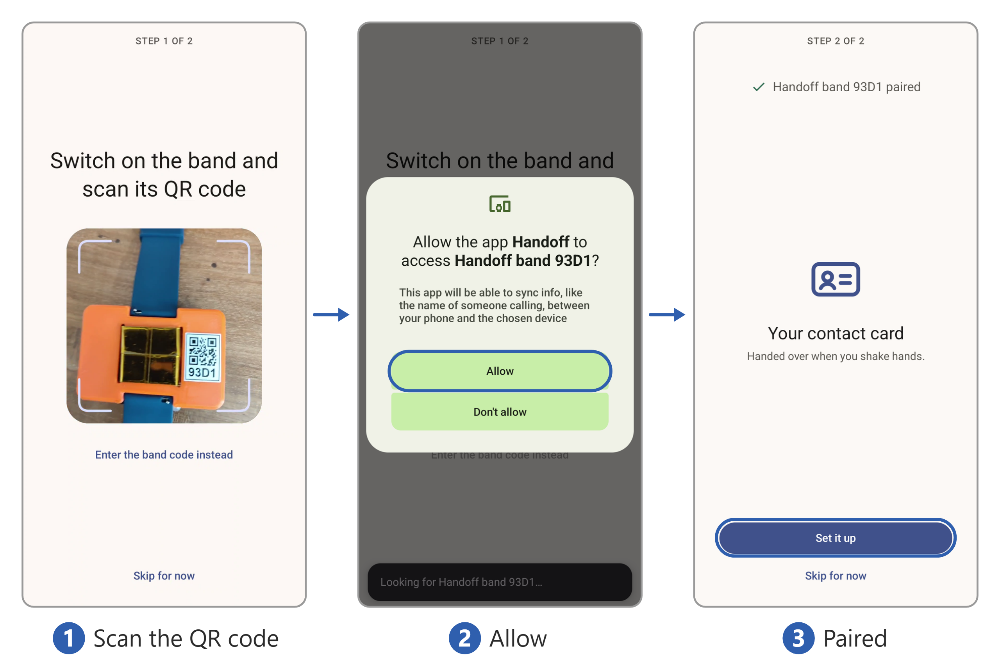

#### 2.2 Your contact card

"Next you set up your contact card in it."

He tapped `Set it up` and looked at the form. Name. Phone. Email. Organisation. Title.

"Do I have to put all the details in here?"

"Only what you'd put on a card. That's all it is, really. It's your card. If you'd rather not give out your personal number, put the work one in. Leave anything blank you like."

He keyed in his details and tapped `Save`. In his hand the band blinked green, twice, quick.

"Green's good. That's your details saved on the band. Pop it on."

He put it on. Left wrist, out of habit, and glanced at her.

"Either one," she said. "Doesn't matter."

He looked at the phone. An empty page. `No handshakes yet`.

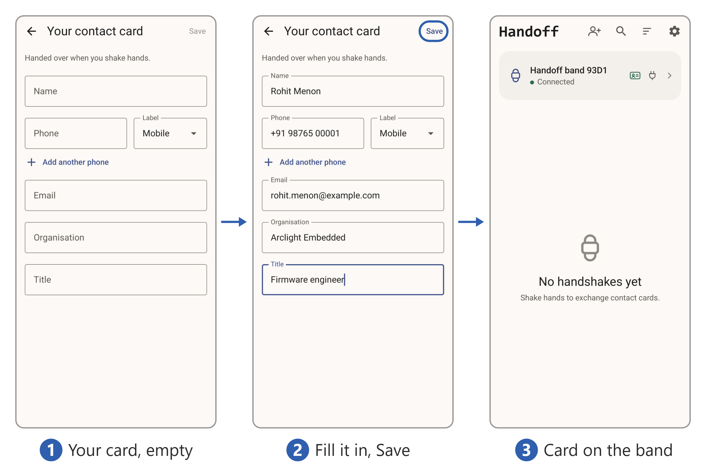

### 3 The handshake

#### 3.1 First contact

"So you're saying I just shake hands. How do I know it's actually worked?"

"Oh, you'll know." She came out from behind the desk and held out her hand with a broad smile. "I'm Savithri, by the way. Lovely to meet you, Rohit."

He took it.

It was an ordinary handshake: warm, firm, a second long. The band on his wrist flickered white, and as he let go it went green and gave a small buzz against his skin.

"Check your phone."

Her name was there. `Savithri Raghavan`. He tapped it. `Met today, 9:14 am`, and under it her number and her email.

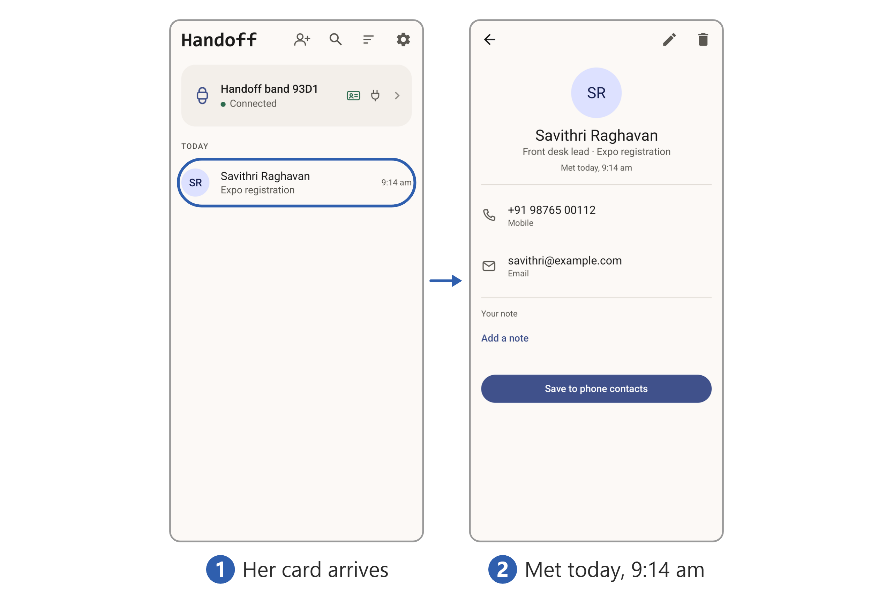

"And you've got me?"

She turned her own phone around. A long list of names, and his at the top.

"Everyone I've said hello to this morning." She grinned. "Cool, right?"

He was still looking at her phone. "Very."

She giggled.

"Will it last the whole event? Do I need to charge it?"

"No." She pointed at the battery beside the band's name on his screen: three bars, all green. "That's plenty. If it ever goes red, come and find me and I'll swap it. But it won't."

He thanked her and walked on towards the expo floor, still putting the puzzle together in his head.

#### 3.2 Keeping track

The morning went by in a blur.

The keynote first, in the big hall, where he got a seat near the front and a handshake from the speaker afterwards. Then a workshop on low-power design, two hours at a bench with five strangers and one oscilloscope between them. Then the stalls, row after row of them, and at every second one a conversation that ran longer than he meant it to.

By lunch he had shaken hands with more people than he could count. The band on his wrist had done its little white flicker every time, and every time a name had landed in the Handoff app.

He had fallen into a routine without noticing. Walk away from the stall. Open the app. There they were, at the top of the list. Tap the name. A name alone would mean nothing by tomorrow, so he changed it. `Vikram Sharma` became `Vikram Sharma (Vivado License)`. Then `Add a note`, and two lines while it was still fresh: what they were working on, what he had promised to send, when they had agreed to talk again.

Fifteen seconds, and on to the next stall.

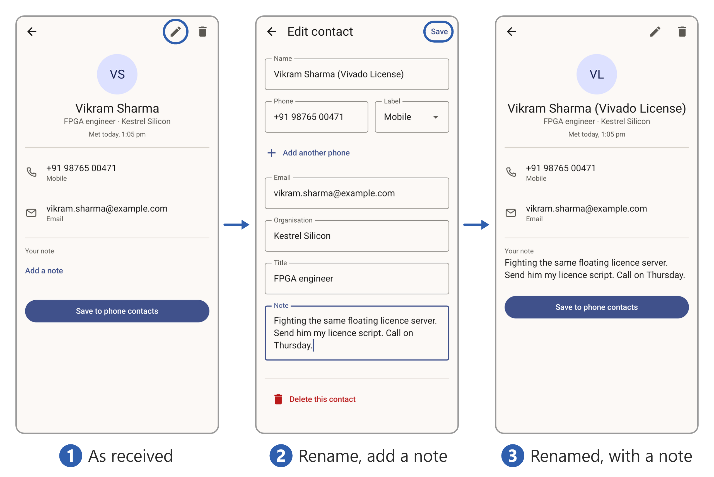

By design, the Handoff app never polluted his phone contacts. They all stayed in the app, where they belonged. And the three or four who mattered, a hiring manager, a supplier, a student whose project he wanted to follow, he tapped `Save to phone contacts`, and they were in his phone book like anyone else. One press. No copying numbers.

Around eleven he went back to the front desk to ask where the workshop had moved to, and Savithri shook his hand again on his way out. He checked the app, half expecting a second Savithri. There wasn't one. The entry he had already renamed to `Savithri Raghavan (front desk)` had simply moved to the top of the list, note and all. The app matches people by their number and email, not their name. Shake the same hand twice and you get one person, not two.

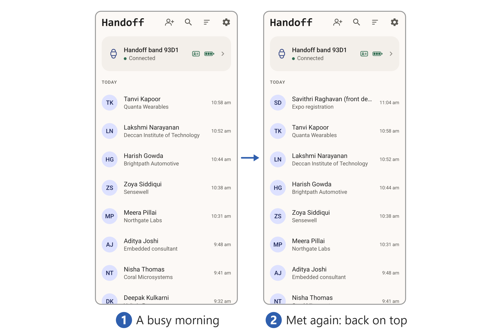

### 4 The companion app

He found the coffee lounge at two, got a hot cup, and took a chair in the corner. The first quiet ten minutes he had had since breakfast.

Time to look at the thing properly.

#### 4.1 Home page

The UI was simple. A band info card at the top of the page, showing the band's name, `Handoff band 93D1`, with `Connected` under it. On the right, a small green card icon showing that his card was saved on it, and a battery with three green bars.

Below it, the people. Everyone he had met, newest at the top, with the organisation and the number under each name, and the time he met them on the right.

Four buttons along the top, beside the Handoff wordmark:

* `Create contact`, for one typed in by hand.
* `Search`, which looks through names, organisations and notes at once.
* `Sort`, flipping the list between `Newest first` and `A to Z`.
* `Settings`.

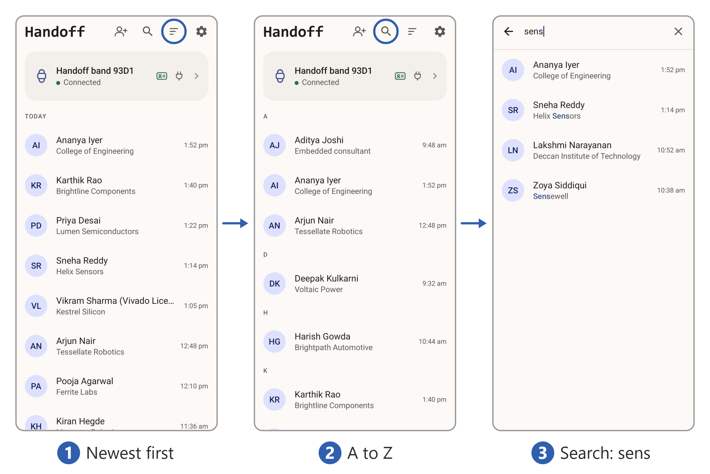

#### 4.2 Band info page

He pressed the band info card. It took him to a page of its own.

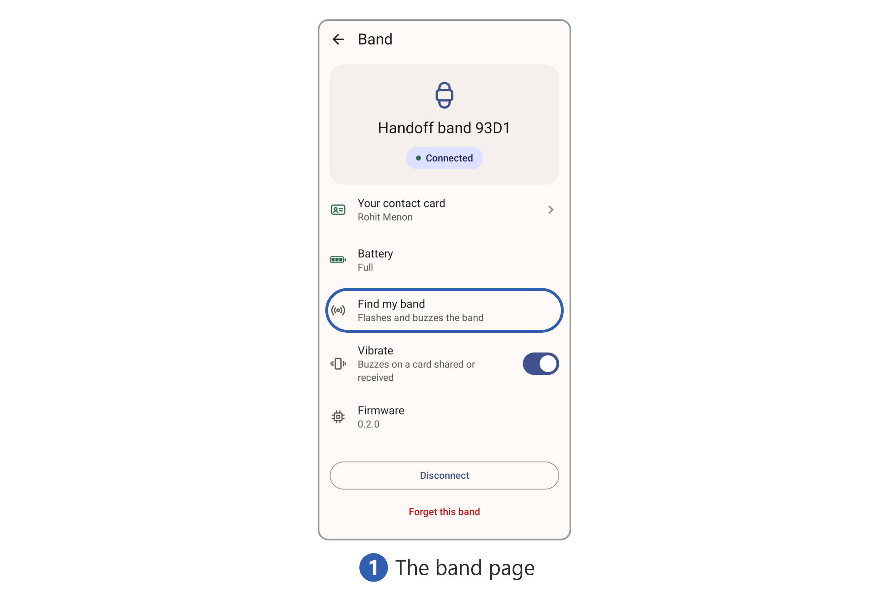

* `Your contact card`, his own contact details.
* `Battery`. It read `Full`.
* `Find my band`, which flashes and buzzes the band.
* `Vibrate`, a switch, already on: `Buzzes on a card shared or received`.
* `Firmware`, a version number.

He tried `Find my band`. On his wrist the band lit up and shivered.

Useful at home, he thought, when it had slipped down the side of the sofa. Here, in a hall with four thousand people in it, if the band came off it was gone for good.

At the bottom, `Disconnect`. Under it, in red, `Forget this band`. He left both alone.

#### 4.3 Card page

He tapped `Your contact card`. There it was, as he had typed it that morning, with a small tick under his name: `On Handoff band 93D1`. Two icons in the top bar, a pencil to edit and a bin to delete the card.

He pressed the bin.

`Delete your contact card?` the app asked. `The band will stop sharing your contact. It will still receive contacts from others.`

He tapped `Delete`. Back on the band info page the green card icon had gone red, with a line through it. No card saved on the band.

He set it up again. Name, phone, email, organisation, title, the same as the morning. This time, at the phone number, he tapped the label. `Mobile`, `Work`, `Home`, `Main`, and at the bottom, `Custom`.

He couldn't resist. He picked `Custom` and typed `IRQ`.

Now the people who shook his hand would get a number labelled `IRQ`. If they knew what an interrupt request was, they'd smile. If they didn't, they weren't his kind of people anyway.

`Save`. The band blinked green, twice, and the icon on the band info page went green again.

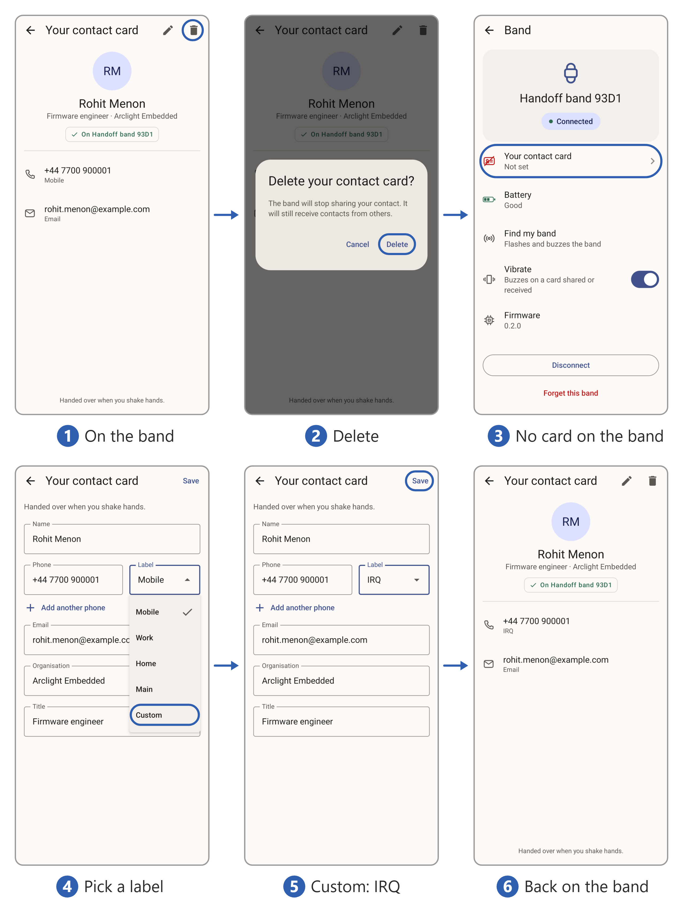

#### 4.4 Settings page

Settings was two short groups.

Under `App`: `Notifications`, `Theme` and `Language`. Under `About`: the app version.

The app has no internet permission at all. Every contact he had collected lived on his phone and nowhere else.

He opened `Theme` and picked `Dark`. The lounge was dim and the white page was a lantern.

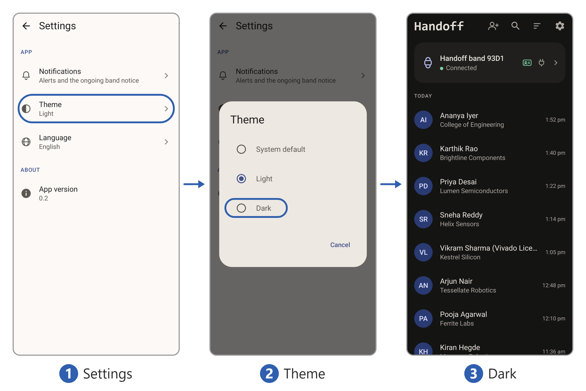

He sat back. The whole app had taken five minutes to walk through, and there had been nothing in it he needed to look up.

### 5 The how

#### 5.1 Plate on the back

The coffee was half gone and the morning's question was still open. He took the band off and turned it over.

A flat metal plate on the back of the case, which gets pressed to the skin. Of course. Two people, two plates, and the handshake closing the circuit between them: a signal sent through his body and picked up on the other side. A galvanic contact, skin to metal.

He tilted it to the light. The plate had a thin clear coating over it. Sealed, edge to edge. No path for a current, which ruled out his first theory.

So the plate wasn't a contact. It was one half of a capacitor. The skin was the other half, and the coating was the dielectric. The metal never touched him, and it did not have to. The band was coupling into his skin through the coating, and the handshake was coupling him into the person whose hand he held.

Capacitive body-coupled communication.

He put the band back on, and finished the coffee. He knew *what* it was now. The next question was *how*.

#### 5.2 What's inside

He had met most of it already, from the outside.

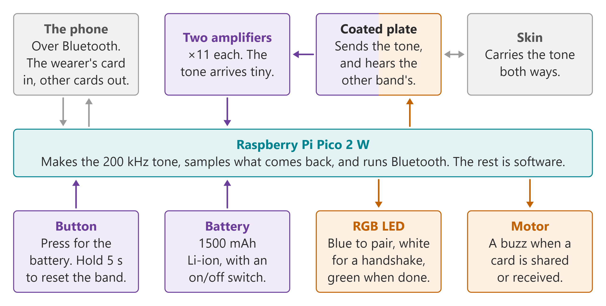

*One band, around its Pico. Purple feeds the Pico, orange is driven by it, and the plate is both. Grey is not part of the band.*

* **One plate, both directions.** The tone goes out through it, and the other band's tone comes in through it.
* **Two amplifiers** between the plate and the Pico, because what arrives is tiny (5.4).
* **The rest is for the wearer:** the button Savithri held for five seconds, the light that blinked, the buzz on his wrist.

**Why a Pico 2 W.** One module does every job in the middle box.

* **The tone is a pin.** PIO, the Pico's small programmable I/O engines, switches a pin at exactly 200 kHz on its own. No oscillator, no driver chip, and the processor is free.
* **The converter reads the tone directly.** It samples 500,000 times a second, fast enough for 200 kHz, so there is no mixer to bring the tone down first.
* **Two cores.** One listens all the time. The other runs the handshake and Bluetooth.
* **Bluetooth on board.** The phone link needs no second chip.
* **A buck-boost converter on board.** A Li-ion cell starts above 3.3 V and ends below it. The Pico takes anything from 1.8 to 5.5 V and makes its own 3.3 V, so the battery needs no regulator.
* **Small.** 21 × 51 mm, and it plugs into a socket on the band's board.

The parts list and every step to build this board are in the appendix.

#### 5.3 One card's journey

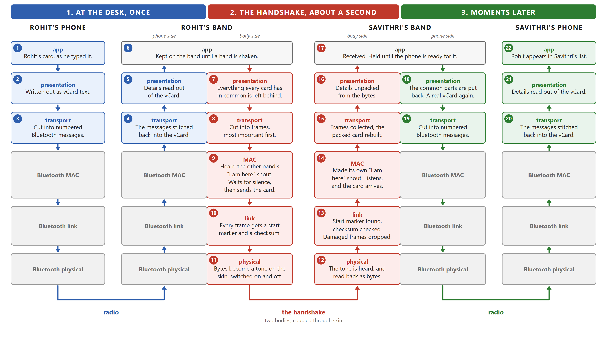

*Rohit's card on its way to Savithri. Hers makes the same trip the other way, at the same time. Click to enlarge.*

* Follow the numbers, 1 to 22.
* **Blue**, at the desk: Rohit's phone gives his card to his band.
* **Red**, the handshake: his band sends it through the two of them, into hers.
* **Green**, a moment later: her band passes it to her phone.
* The small word in each box is the layer's name. The sentence under it is what happens.
* Grey is Bluetooth. It works, so it is left alone.
* Red had to be designed from nothing. Two boxes to come back to:
  * **Box 7** throws away what every card has in common, and **box 18** puts it back. Why?
  * **Box 9** heard a shout, and sent. Who shouted?

Everything in red comes from three facts:

1. The wire is a person.
2. A handshake is about a second long.
3. Nobody announces it.

#### 5.4 The wire is a person

The wire is somebody, so it must be safe. And it is a terrible wire, so little gets through.

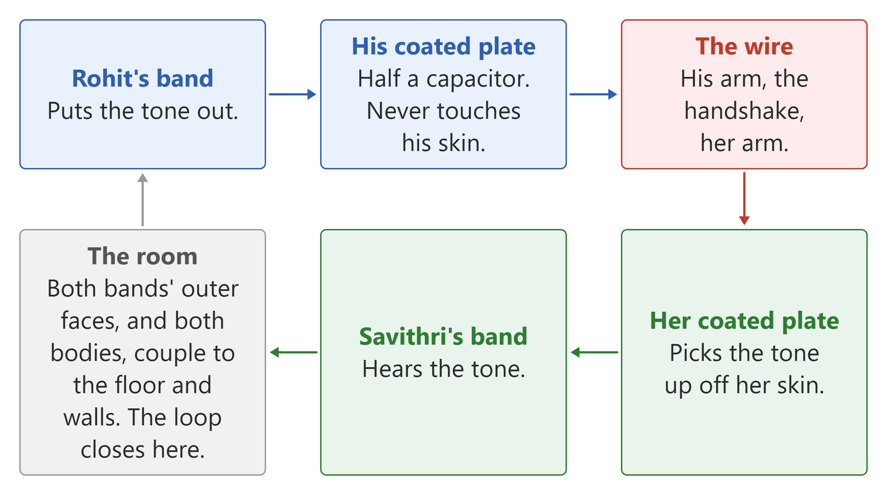

*The loop a handshake makes. The only thing that touches is the two hands.*

* **The plate never touches skin.** It is half a capacitor, and reaches the body through an electric field, not through metal on skin.
* **The room carries the signal back.** Nobody holds a second wire, so each band's outer face couples to the floor and walls.
* That is the weakest step. Rubber soles on a dry floor thin it out.

[TODO when the boards arrive, then delete this note.
The shoes line above may be backwards. In the usual model, the body leaks signal to the floor, and rubber soles cut that leak, so shoes could make the link stronger.
Check, received tone level in LSB and whether a card decodes, same two people, same grip:
- both barefoot
- both in rubber-soled shoes
- repeat each three times
Then keep the line, flip it, or delete it, to match what was measured.]
* **Battery only.** A band is never worn while it is plugged in. The full safety rules are in appendix A.1.

[TODO when the boards arrive, then delete this note.
Write: one bullet, "**Touch, not air.**", saying the signal needs skin contact and someone standing close cannot pick it up. Give the real numbers.
Check (design doc §14.1), received tone level in LSB and whether a card decodes:
- hands clasped
- hands 1 cm apart
- hands 10 cm apart
- sender's plate off the body, everything else unchanged
Pass: a card at "clasped", nothing at 10 cm and plate-off.]

* **Most of the signal is lost** getting into the body and out again. About one part in 2,500 survives.
* **So, two amplifiers of ×11** make it big enough to read.
* **No mixer, no oscillator.** The software asks one question: *is the tone there right now?* Noise at other pitches is never counted.
* **200 kHz**, as high as the converter can see. A higher tone crosses the room more easily.
* **On and off.** The tone is switched, and the pattern is the data. The two bands never need to agree on timing.

#### 5.5 From tone to bits

Three steps: hear the tone, read each bit, find where the card starts.

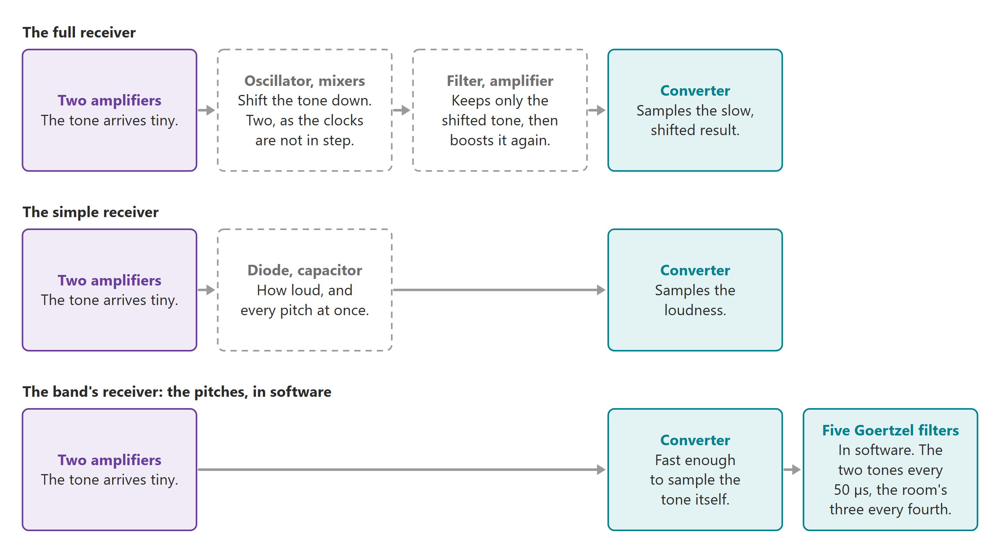

*Dashed: the parts the band does not have.*

There are two usual ways to hear a tone that switches on and off.

* **The full receiver** shifts the tone down with an oscillator and a mixer, then filters and amplifies it again.
* **It needs two mixers**, I and Q. The two bands run on separate clocks, so the tone arrives at any phase, and one mixer's output fades with the phase.
* **The simple receiver** is a diode and a capacitor, an envelope detector. Or a tone-decoder chip such as the LM567.
* **The band does all of it in software.** The converter samples the tone itself, 500,000 times a second. A **Goertzel filter** turns every 25 samples into one number: how much 200 kHz is there, at any phase.

**Better than the full receiver:**

* **Four parts gone**, about half the analogue circuit.
* **No mixer offset** drifting under the reading.

**Better than the simple receiver:**

* **A diode hears every pitch.** Mains hum, phone chargers and lights all count as signal. Goertzel counts only 200 kHz.
* **The LM567 only says yes or no.** The band needs a number, to tell which half of a bit is louder (below).
* **The pitch never drifts.** The LM567's pitch is set by a resistor and a capacitor. Goertzel's is set by the crystal clock.

**Why Goertzel and not an FFT.** Both measure frequencies. An FFT measures all of them, and the band needs one.

* **One answer, not thirteen.** An FFT of 25 samples returns 13 frequencies. Twelve would be thrown away.
* **Sample by sample.** Goertzel updates two running numbers as each sample lands. There is no block to store, and the answer is ready with the 25th sample.
* **Any length.** A standard FFT wants 16 or 32 samples. At 32, 200 kHz falls between two frequencies and smears across both. 25 samples hold exactly ten cycles of the tone, so it sits dead on one.
* **Cheap.** It keeps about a quarter of one core busy.

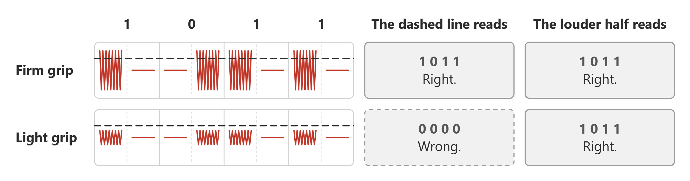

*The same four bits, through a firm grip and a light one.*

* **Each bit is two halves.** Tone then silence is a 1. Silence then tone is a 0. This is Manchester coding.
* **How much arrives changes** with grip, posture and shoes. A fixed line reads the firm grip and misses the light one.
* **So the receiver compares the two halves.** The louder one is the same for any grip.
* **Every bit changes in the middle**, so the receiver never loses count.
* **The cost is half the speed:** 2,000 bits a second.

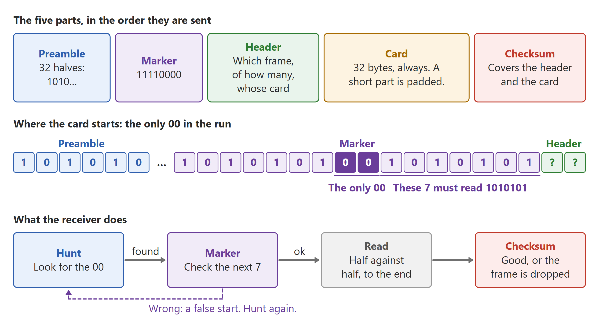

*One frame, 156 ms. Each part keeps its colour in all three rows.*

* **The start is a landmark, not a count.** Some of the preamble is lost while the receiver wakes up, so it never counts halves. It looks for the one 00, then checks the seven halves after it.
* **No length field.** A length can itself arrive damaged. Every frame is the same size, and the header says how many frames make the card.

#### 5.6 The card is too big

* A vCard is nearly half common parts: `BEGIN:VCARD`, `TEL;TYPE=CELL`, `END:VCARD`.
* The link is slow. Sent as text, Rohit's card alone takes the whole second. Savithri's never gets a turn.

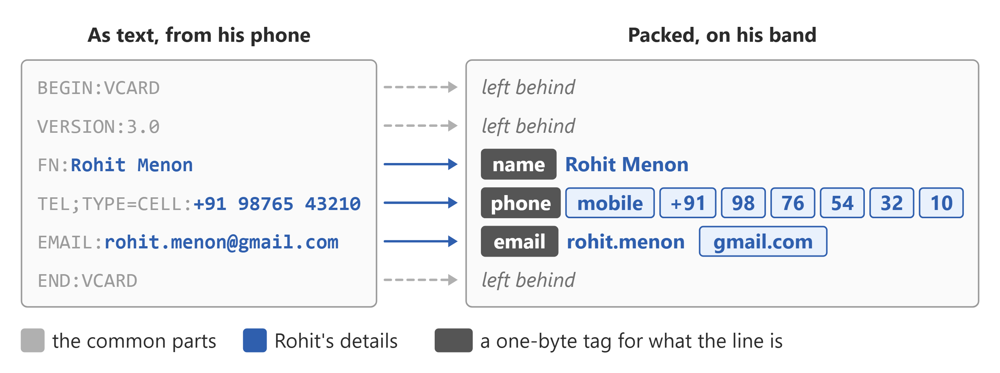

*A card like Rohit's, as text and packed.*

* **Packed (box 7):** labels become one-byte tags, digits go two to a byte, common email domains become one byte. 169 bytes becomes 79, and both cards fit.
* **Packed once, at the desk.** The band stores only the packed card, so a handshake has nothing left to do but send.
* **Savithri's band rebuilds it** (box 18) into a proper vCard before her phone sees it.

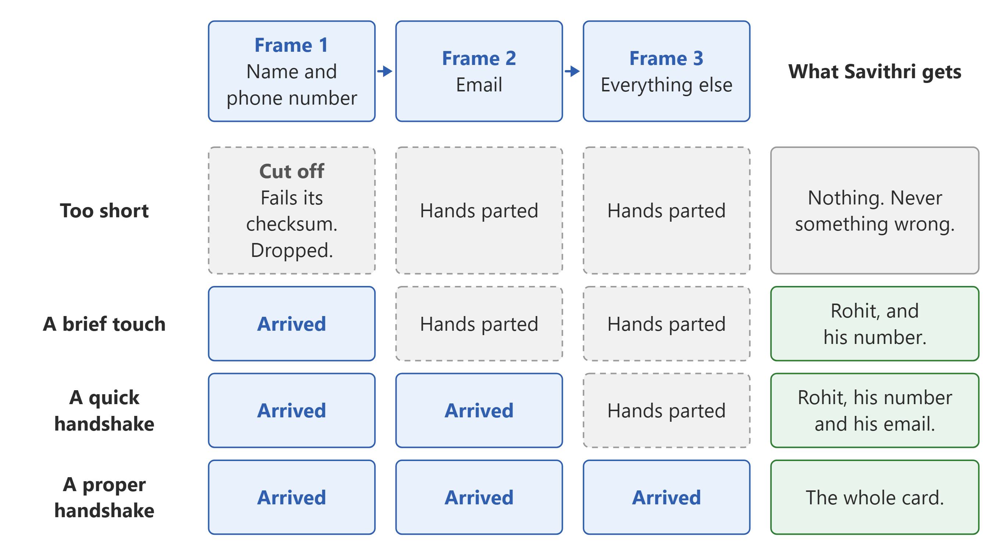

*Sent most important first. Nothing is ever asked for twice.*

* **Most important first:** name and number, then email, then the rest.
* **Never half a field.** Every frame reads on its own, so a number never arrives with the wrong label.
* **No asking again.** There is no time. A damaged frame fails its checksum and is dropped.
* **Whatever arrived goes to the phone.** If the hands part after frame 1, Savithri still gets his name and number. Without frame 1 she gets nothing.

#### 5.7 Nothing says go

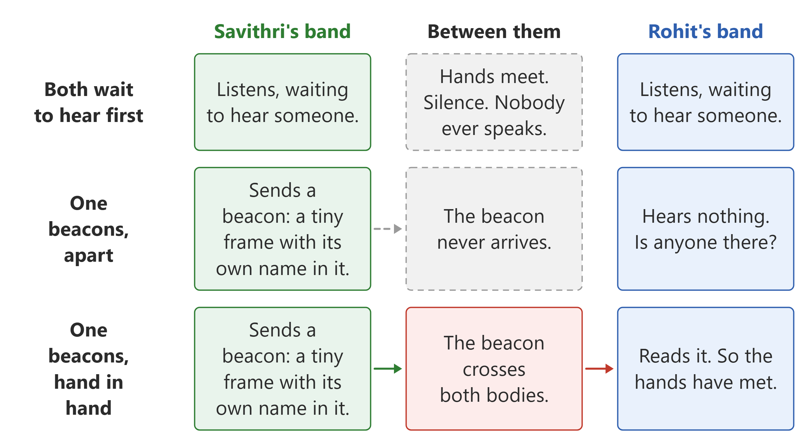

* The band has no button for this, no accelerometer, no touch sensor.
* **Listening first fails.** Before the hands meet, the other band cannot be heard at all, so quiet means nothing.
* If every band waits to hear someone, no band ever speaks.

* **Being heard is the touch.** There is no channel until the hands meet. Hearing another band means they have.
* **Any touch counts.** A hug, a pat on the back or hands brushing in a queue swaps cards too. That is fine: a card lands only in the app, never in the phone book, and one tap deletes it.
* **So every band shouts**, out of step with every other:
  * a short, flat "I am here" shout
  * a moment for its amplifier to recover
  * listen, for a random time
  * and round again
* It listens most of the time, so a shout almost always lands.

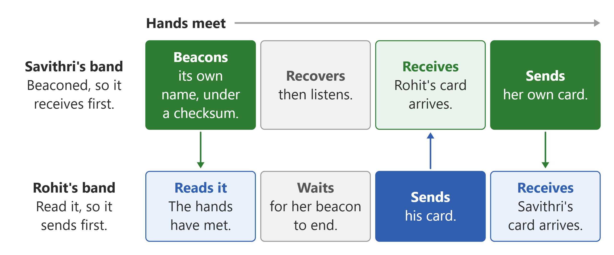

*09:14 at the front desk.*

* **The hearer sends (box 9).** Only the band that heard the shout knows a handshake has started, so it is the one that acts.
* **The shouter receives.** As far as it knows it shouted into an empty room, and it is listening when the card arrives.
* **Nothing to decide.** A band is deaf while it shouts, and a band that has heard a shout does not shout. So only the first shout can be heard, and only by the other band.
* Two shouts at the same instant: neither is heard, and both go round again with fresh random times.
* **Why not skip the shout, and send the card blind?** A band that is sending is deaf. Two blind senders talk over each other, and both cards are lost.
* **One pad, one direction.** The band taking its turn waits twice the recovery time, so the other end is certainly listening.
* Simulated across all 112 timings two bands can have: exactly one sender, every time.

### 6 Where the reasoning was wrong

Three decisions that looked right on paper and turned out wrong. Each one changed the design.

#### 6.1 Off is not low

* The tone is switched on and off (5.4). At first, *off* meant holding the pin at 0 V.
* Zero is zero. It looked harmless.
* But a band has one pad, for sending and for listening. The pad is wired to the band's own amplifier.
* Holding it low pulled that amplifier to the bottom of its range. Every frame did it, over and over.
* When the frame ended, the amplifier took **17 ms** to recover. The budget for turning round is **1 ms**.
* So every frame a band sent left it deaf, just when the other band's frame was due.
* **Fix: off means let go.** The pin is released, not held. The pad rests in the middle, and the amplifier never notices a frame going out.

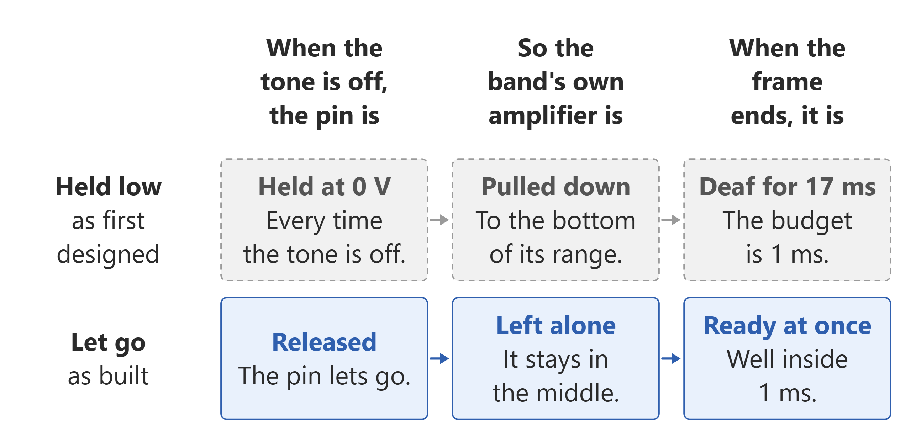

*What a band does to itself when the tone is off.*

* **One capacitor between the two amplifier stages made smaller**, as a backstop. Any jolt that still gets through is gone in a fraction of a millisecond.
* The other band gains too. A held-low *off* put a step on the pad thirty times bigger than the tone, and the body carried it across. A released pad sends nothing.
* Caught by working through the circuit, before the amplifier was built. One change in the firmware, one part on the board.

#### 6.2 Saying it twice

* The card is three frames, most important first (5.6). Frame 1 is the name and the number.
* The plan was to send frame 1 every other time: 1, 2, 1, 3, 1, 2... Half the airtime on what matters most.
* It sounded safe. It was the worst option.
* A frame takes 156 ms. About six fit in a one-second handshake, shared between the two bands.
* Every repeat of frame 1 is a frame the other band already has. The frame it still needs never goes.

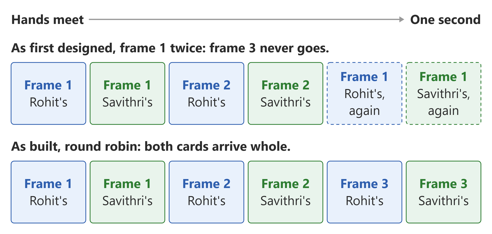

*What the channel carries in a one-second handshake. The two bands take turns, three frames each.*

* Simulated over one-second handshakes:
  * frame 1 every other time: a complete card **0 %** of the time
  * each frame once, in turn: both cards complete **every time**
* **Fix: plain round robin.** 1, 2, 3, then round again.
* A brief touch still gets a name and a number. Round robin sends frame 1 first anyway.
* The order was what kept that promise. The repeating never did.

#### 6.3 The gain that wasn't free

* The pad and the skin make a capacitor. Add one inductor, tuned to 200 kHz, and the two resonate.
* On paper, **20 to 30 dB** more signal, for one cheap part. Very tempting, with so little getting through (5.4).
* But a resonance only builds up when little is lost along the way.
* This link loses a lot on purpose, to keep the wearer safe. The same loss flattens the resonance before it can build.
* Left out. Written down here so nobody tries it again.

### 7 The end

The taxi pulled onto the flyover, and Rohit let his head fall back against the seat. He had made it. Just.

He was still smiling.

He had only meant to peep in at one last stand on his way out. He had stayed half an hour. The man behind the table, Farhan, had hit the same problem Rohit had been fighting for three weeks, and had got round it a different way. They had leaned over the same board and argued it through, neither giving an inch. Rohit still thought Farhan's fix was wrong. But while he was arguing against it, he had finally seen what he had been missing. It had been in his own drawing all along.

He laughed at himself out loud, and the driver glanced at him in the mirror.

Both from Bengaluru, it turned out. They had come all the way to Hyderabad to meet.

Then he froze for a moment.

He had not got Farhan's number.

He went back through it in his head. The taxi calling. Running to the front desk. Pulling the band off his wrist and pushing it across to Savithri. "Flight!" "Go!"

And before that?

Before that, a quick handshake across the table, half a goodbye, already turning to go. Did the band buzz? He couldn't remember.

He opened the Handoff app. First in the list:

`Farhan Ansari`
`Met today, 5:02 pm`

Rohit let out a breath. The band was gone. Everything it had carried was still here.

He tapped the name and edited it to `Farhan Ansari (sparring partner)`. Then `Save to phone contacts`.

He opened a DM with him on WhatsApp.

`Hi Farhan, Rohit here. The one who said your fix would never work. Still don't think it will. Coffee next week, and you can try to convince me?`

Two blue ticks. Then `typing…`

`Knew it was you, I did save your number. Once I am back in the city I will raise an IRQ ;)`

His kind of people.

A connection was made.

---

### The boards, from PCBWay

This is my first sponsored project. [PCBWay](https://www.pcbway.com/) manufactured the PCBs and shipped them to me. I only had to source the components.

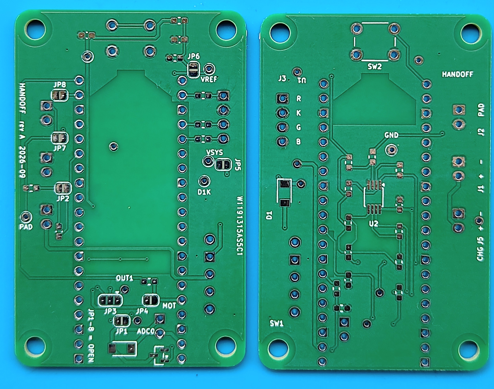

**It started with their email.** PCBWay wrote on 10 September offering to sponsor a project. The board didn't exist yet, and the deadline was 16 days away. I designed it in two days and placed the order on Saturday

**Their engineers were super helpful and prompt.**

* **The finish.** I had picked leaded HASL on the order form but asked for lead-free in the notes. Tori caught the mismatch that same Saturday and asked which one I meant.
* **The antenna.** Under the Pico's antenna there is a patch with no copper on either side. That's deliberate. To a fab it looks like a slot someone forgot to draw. Sophia asked me instead of guessing. Then she sent back the exact files they had received so I could check them against mine. It was settled the same morning.

**Speed.** Ordered on 12 September. All questions closed by Monday the 14th. Shipped by DHL on the 15th, and at my door on [date].

**Quality.** []

**Serene**, in their marketing team, made the whole thing easy, from the first email to the order going through.

Thank you to PCBWay, and to Serene, Tori and Sophia, for backing my project. If you want to build a pair, the appendix has the board files ready to upload to PCBWay.

---

### Appendix — Build one yourself

*The story ends above. This part is reference: how to build your own pair of bands.*

* A handshake needs two bands, so build two.
* Each band pairs with one Android phone, so you need two phones as well.
* Everything is in the project repository, [github.com/rahuljeyaraj/Handoff](https://github.com/rahuljeyaraj/Handoff). Each step below names the file with the full detail.

#### A.1 Safety first

* **Battery only while worn.** Never touch a band's plate while it is plugged into a computer.
* **The plate is always covered.** No bare metal on skin.
* **Nobody with a pacemaker or an implanted defibrillator** wears one.
* **Build the parts around the plate exactly as listed.** They keep the current through a person under 3.3 µA, on either wrist and with either hand. A person starts to feel about 1 mA.

The full rules are in `docs/body-coupled-handshake-design.md`, section 13.

#### A.2 What you need

For each band:

* **The board.** Upload `hardware/build/handoff-pcbway.zip` to [PCBWay](https://www.pcbway.com/). `hardware/build/order.md` has every answer the order form asks for.
* **The parts on the board**, listed in `hardware/bom.csv`: a Raspberry Pi Pico 2 W, one MCP6292 amplifier chip, 0603 resistors and capacitors, two diodes, one transistor, the connectors, a slide switch and a push button. `hardware/README.md` gives the exact part numbers.
* **Off the board:** a 5 mm RGB LED, a 10 mm coin vibration motor, a 3.7 V Li-ion cell with a JST-XH plug, and a TP4056 charger module.
* **For the plate:** a 25 × 25 mm square of single-sided copper-clad board, and clear packing tape.
* **The box.** Print the two halves in `hardware/enclosure/`: `bottom.3mf` and `top.3mf`.
* **Four M3 brass heat-set inserts**, 5 mm across, and four M3 screws.
* **A 22 mm watch strap.**

Tools:

* A fine soldering iron, flux, solder wick, tweezers and isopropyl alcohol.
* A 3D printer, or a printing service.
* A multimeter. No oscilloscope is needed at any step.
* A PC with Python 3, and a micro-USB cable.

#### A.3 Set up the PC

* **Firmware tools.** Install VS Code and its Raspberry Pi Pico extension. Open the repository folder and accept the SDK download. That installs the compiler and everything else the build needs.
* **Bring-up script.** Run `pip install pyserial`.
* **App tools.** Install Android Studio.

The root `README.md` covers the same, including Linux.

#### A.4 Build the board

Follow `docs/hardware-bringup.md`, one step at a time. It has a drawing of each face.

* **Solder in three passes:** small parts on the top face, small parts on the bottom face, then the through-hole parts.
* **Check after every pass** with the meter. Each step lists what to measure and what it should read.
* **The eight solder jumpers, JP1 to JP8, all start open.** Close each one only when its step says so. That way each block is proved before the next is joined to it.
* **Clean with isopropyl alcohol** after every pass, and let it dry. Flux left near the amplifier upsets it.
* **One script runs every powered check:** `scripts/bringup.py`. It flashes a test program, then switches the LED, the motor and the transmitter from the PC.

The last step flashes the real firmware:

```
python scripts/bringup.py flash handoff
```

By then both directions of the signal path have been checked.

#### A.5 Print the label

The app finds a band by the QR code on its back.

* With the band on USB, run `python scripts/bringup.py watch`. At start-up the band prints a line like `name "Handoff band 7A3C", label 7A3C`.
* Run `pip install "qrcode[pil]"`, then `python tools/band_label.py 7A3C`.
* That makes `band-7A3C.png`: the QR code, with the four characters printed under it. Print it small.

#### A.6 Make the plate

* **Solder a wire** to the copper side of the square.
* **Cover the copper completely** with one layer of clear packing tape. Thinner tape works better.
* **Plug the wire into J2's PAD pin.** Leave J2's other pin empty.
* **Fix the plate to the back of the box**, taped side out, so it rests on the wrist.
* **Keep the board and the cell between the plate and the outside of the box.** The board's own copper faces out, and that is what reaches the room.

#### A.7 Put the band together

* **Press the four brass inserts** into the posts in the bottom half, with the soldering iron.
* **Screw the board down** onto them.
* **LED into J3**, the longest leg into `K`.
* **Motor leads into J6**, either way round.
* **Cell into J1.** Check the plug first: the square pad is minus.
* **Charger:** TP4056 `OUT+` to J5 `+`, `OUT−` to J5 `−`. J5 is only for charging the cell.
* **Fit the top half.** Stick the label on the back, beside the plate.
* **Fit the 22 mm strap.**
* **Slide the switch on**, to the position you marked during bring-up.

#### A.8 Install the app

* Open the `android` folder in Android Studio.
* Turn on USB debugging on the phone and plug it in.
* Press Run.

`android/README.md` has the command-line route.

#### A.9 Pair and set up

The same steps Rohit took at the desk in chapter 2.

* **Switch the band on.** A slow blue pulse means it is waiting for a phone.
* **In the app, tap `Pair a band`** and scan the label. Android asks you to confirm one device.
* **Set up your contact card** and tap `Save`. The band blinks green twice.
* **To hand a band to someone else,** hold its button for five seconds. It forgets its phone and its card, and pulses blue again.

#### A.10 The first handshake

* Two people, one band each, plate on the wrist.
* Both phones paired and nearby. The app does not need to be open.
* **Shake hands**, a normal firm grip.
* The band flickers white while the cards cross, then turns green and buzzes.
* Each name is now in the other person's app.

#### A.11 If something goes wrong

* **The Pico does not show up on USB.** Hold its BOOTSEL button while you plug it in, then flash again.
* **The app cannot find the band.** Turn the phone's Bluetooth off and on again, then retry.
* **Anything during bring-up.** The table at the end of `docs/hardware-bringup.md` lists each symptom and where to look.
