**Handoff: shake hands, share contacts**

*The PCBs for this project were sponsored by [PCBWay](https://www.pcbway.com/). More about them towards the end.*

### 1 The idea

History remembers the first message sent on every new technology.

* Morse, 1844: *What hath God wrought.*
* Bell, 1876: *Mr Watson, come here.*
* Marconi, across the Atlantic, 1901: a single letter. *S.*
* ARPANET, 1969: *LO*. It crashed before the G.

Each one was a triumph over distance. Further, faster, across an ocean, around the planet. A hundred and eighty years of engineering, all pointed the same way: *away.*

Shortwave reaches 10,000 km. FM radio, 50 km. Wi-Fi, 50 m. Bluetooth, 10 m. NFC, 4 cm.

*Handoff: 0 cm.*

But the connection that matters most was never far away. It happens in a room, between two people, at no distance at all.

Picture it. You're at an expo. Someone stops at your stand and asks a question. Not a polite one, a real one, the kind only a person who has hit the same problem would ask. Ten minutes later you're both leaning over the same board. They solved it differently. You disagree about the fix, and you like them for it.

Half an hour in, you know things about this person no profile could tell you. How they think. What they'll admit to not knowing. Whether they laugh at their own mistakes. This is how trust is made: not sent, not received. Made. In person, close enough to see the other person think.

It is the kind of connection worth keeping. And you both know it has to be kept somehow, but he only meant to peep in on his way past, and now he has a flight to catch. Out come the cards, if either of you brought any. Or a phone, tilted at the badge, hunting for the QR code the organiser printed too small. Or *"are you on LinkedIn? How do you spell that?"* Sometimes, in the rush, it doesn't happen at all. You remember on the way home that you never got their number, and it stays with you for weeks.

But there is one thing you will never forget to do before you part. You've done it at the end of every conversation that mattered, your whole life. It needs no card, no phone, no app. It carries everything the last half hour built.

You shake hands.

And that's the whole idea.

Handoff is a band on the wrist. When two people wearing one shake hands, their contact details cross between them and land in each other's phones. They travel through the handshake itself, through the two of you.

You let go, and the conversation can carry on next week. The handshake that closed it is the one that kept it.

> Built for element14's **Make a Connection** contest, which asks for an electronics project that sends a message or signal. The message Handoff sends is a contact card, and the medium is two people shaking hands. So a connection is made between the bands, and a deeper one between the people wearing them.

### 2 The gallery

That is the idea. Here is the thing itself, before the rest of the post takes it apart.

**[Watch the demo](PASTE-YOUTUBE-LINK-HERE)**

<!-- TODO: replace PASTE-YOUTUBE-LINK-HERE with the YouTube URL -->

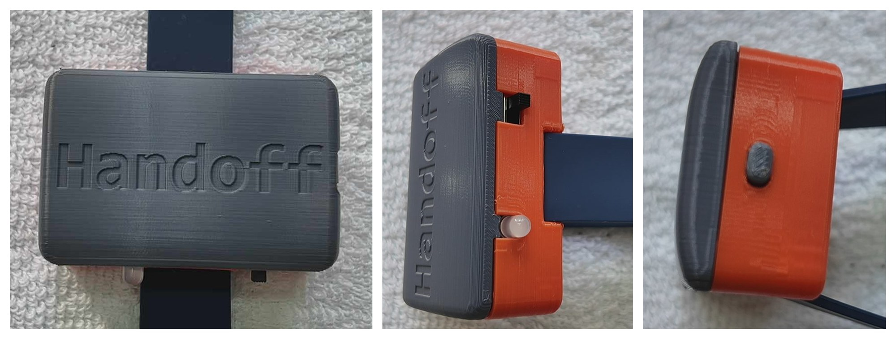
*Figure 2.1. A finished band on its strap. The lid, then the side with the power switch and the light, then the end with the single button.*

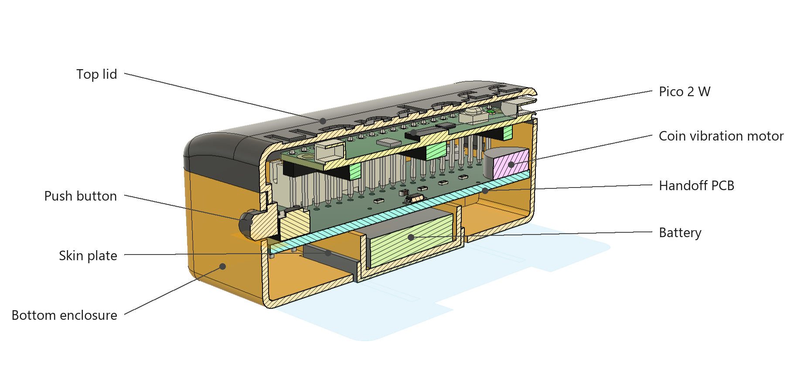
*Figure 2.2. The same band in section. The skin plate at the bottom is the one that meets the wrist, and the whole of this post is about getting a signal from that plate, through a person, into the plate on someone else's band.*

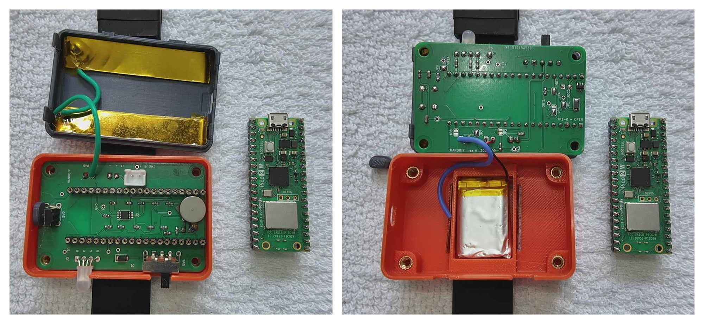
*Figure 2.3. Opened up. Left: the Pico lifted out of its socket, leaving the band's own board with the amplifier, the motor, the switch, the button and the light on it. Right: the board out as well, turned over, and the cell in its pocket.*

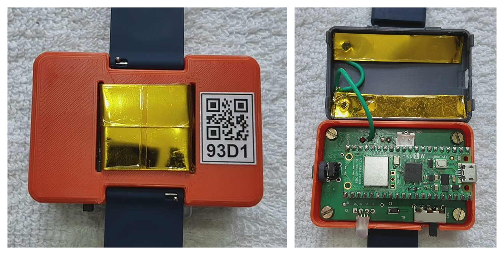
*Figure 2.4. There are two plates, not one. Left: the skin plate, taped over and recessed into the back, with the band's label beside it. Right: the same band opened, and the second plate inside the lid. Section 6.4 is why the second one matters.*

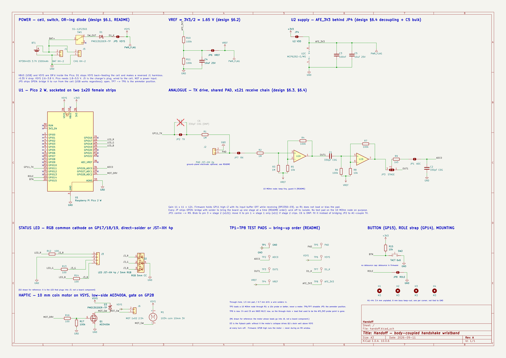
*Figure 2.5. The whole circuit, on one sheet. A Pico 2 W does everything digital, top left. The block in the middle is the part this post is really about: one pin drives the skin plate, and the same plate feeds an amplifier that lifts what comes back off the other person. The rest is a cell and a switch, the light, the motor and the button.*

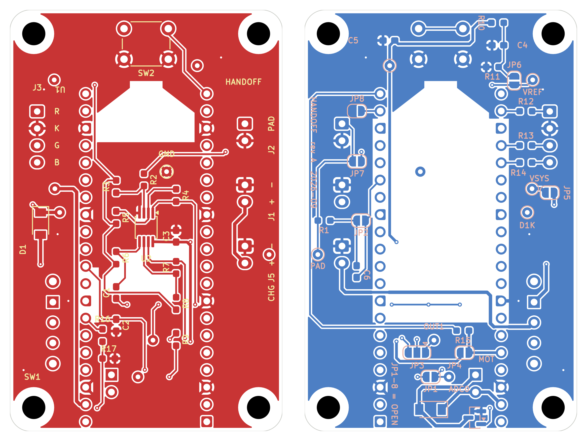
*Figure 2.6. The board, 40 by 62 mm, two layers. Left: the top, where the Pico sits on two header strips, with the amplifier beside it and the plugs around the edge. Right: the same board seen from underneath, which carries the rest of the small parts and a row of solder jumpers. Every jumper ships open, so the board can be brought up one stage at a time. Chapter 9 is where these came from.*

*Want to build a pair? Everything you need is in the appendices at the end: the parts list in appendix A, the build in appendix B.*

### 3 The setup

The registration desk at the expo. The queue moved quickly, and then it was his turn. The woman behind the desk looked up with a warm smile, as if she had been expecting him.

"Hi! Welcome! Your name?"

"Rohit Menon."

"Rohit Menon." A finger ran down the list. "Got you. Here's your badge." She slid a lanyard across, and before he could pick it up she was reaching under the counter. "And this. Everybody gets one of these."

It was a band. A small orange case, on a dark strap.

"What is it?"

"It's a Handoff band. It's for swapping contacts." She held up her own wrist, showing her band. "You shake hands with someone who's wearing one, and their contact details land on your phone. Yours land on theirs. That's it. No cards, no scanning badges."

He looked at her, then at the band. "Just from the handshake."

"Just from the handshake." She was clearly enjoying his surprise. "I know. Everyone does that face."

#### 3.1 Pairing with the phone

"Hang on, this one came back from an earlier session, let me reset it for you."

She pressed her thumb on the button and held it there, counting under her breath. At five the band gave a little purple blink and she let go. It settled into a slow blue pulse.

"There. Fresh." She handed it over. "Blue means it's waiting for a phone."

He turned it over in his hands. No screen. Nothing to type on. He looked up.

"Does it have a companion app?" His engineering mind, already working on the puzzle.

"Yes, there's an app." A little surprised, she pointed at the sign beside her: two hands clasped in a handshake, and the word *Handoff* under it. "It's on the store, just search Handoff. Same logo."


*Figure 3.1. The Handoff logo.*

He found it and installed it. The queue behind him, mercifully, was short.

"Open it up. It'll ask for the band. See the little QR code on the back? Scan it with the app."

He held the band in one hand and the phone in the other. The phone gave a small tick. A moment later the slow blue pulse went solid, held for a second, and went out.

"That's it. Paired. It's yours now."


*Figure 3.2. Pairing with the phone.*

#### 3.2 Your contact card

"Next you set up your contact card in it."

He tapped `Set it up` and looked at the form. Name. Phone. Email. Organisation. Title.

"Do I have to put all the details in here?"

"Only what you'd put on a card. That's all it is, really. It's your card. If you'd rather not give out your personal number, put the work one in. Leave anything blank you like."

He keyed in his details and tapped `Save`. In his hand the band blinked green, twice, quick.

"Green's good. That's your details saved on the band. Pop it on."

He put it on. Left wrist, out of habit, and glanced at her.

"Other wrist," she said. "It has to be on the hand you shake with."

He moved it across and looked at the phone. An empty page. `No handshakes yet`.


*Figure 3.3. Your contact card.*

### 4 The handshake

#### 4.1 First contact

"So you're saying I just shake hands. How do I know it's actually worked?"

"Oh, you'll know." She came out from behind the desk and held out her hand with a broad smile. "I'm Savithri, by the way. Lovely to meet you, Rohit."

He took it.

It was an ordinary handshake: warm, firm, a second long. The band on his wrist flickered white. Before he had even let go it went green and gave a small buzz against his skin.

"Check your phone."

Her name was there. `Savithri Raghavan`. He tapped it. `Met today, 9:14 am`, and under it her number and her email.


*Figure 4.1. First contact.*

"And you've got me?"

She turned her own phone around. A long list of names, and his at the top.

"Everyone I've said hello to this morning." She grinned. "Cool, right?"

He was still looking at her phone. "Very."

She giggled.

"Will it last the whole event? Do I need to charge it?"

"No." She pointed at the battery beside the band's name on his screen: three bars, all green. "That's plenty. If it ever goes red, come and find me and I'll swap it. But it won't."

He thanked her and walked on towards the expo floor, still putting the puzzle together in his head.

#### 4.2 Keeping track

The morning went by in a blur.

The keynote first, in the big hall, where he got a seat near the front and a handshake from the speaker afterwards. Then a workshop on low-power design, two hours at a bench with five strangers and one oscilloscope between them. Then the stalls, row after row of them, and at every second one a conversation that ran longer than he meant it to.

By lunch he had shaken hands with more people than he could count. The band on his wrist had done its little white flicker every time, and every time a name had landed in the Handoff app.

He had fallen into a routine without noticing. Walk away from the stall. Open the app. There they were, at the top of the list. Tap the name. A name alone would mean nothing by tomorrow, so he changed it. `Vikram Sharma` became `Vikram Sharma (Vivado License)`. Then `Add a note`, and two lines while it was still fresh: what they were working on, what he had promised to send, when they had agreed to talk again.

Fifteen seconds, and on to the next stall.


*Figure 4.2. Keeping track.*

By design, the Handoff app never polluted his phone contacts. They all stayed in the app, where they belonged. And the three or four who mattered, a hiring manager, a supplier, a student whose project he wanted to follow, he tapped `Save to phone contacts`, and they were in his phone book like anyone else. One press. No copying numbers.

Late in the morning he went back to the front desk to ask where the afternoon sessions were, and Savithri shook his hand again on his way out. He checked the app, half expecting a second Savithri. There wasn't one. The entry he had already renamed to `Savithri Raghavan (front desk)` had simply moved to the top of the list, note and all. The app matches people by their number and email, not their name. Shake the same hand twice and you get one person, not two.


*Figure 4.3. Met again.*

#### 4.3 What the band was telling him

By the afternoon he had stopped looking at it. The band had a small vocabulary and he had picked up all of it without trying: white while the hands were together, green when a name had landed, and nothing at all the rest of the time.

Everything it can say is in Figure 4.4, running at the speed it really says it.

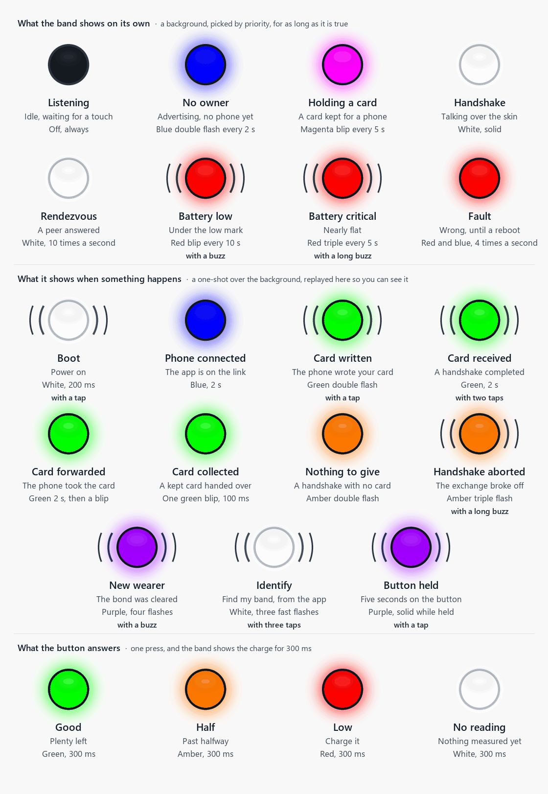
*Figure 4.4. Every light the band can show, and every buzz, at its real speed. The first group is what it shows on its own, the second is what it does when something happens, and the third is the button's answer about the charge. Arcs beside a bead mean the motor is running. The one-shots are replayed on a loop here so they can be seen; the timing inside each flash is the band's own.*

### 5 The companion app

He found the coffee lounge at two, got a hot cup, and took a chair in the corner. The first quiet ten minutes he had had since breakfast.

Time to look at the thing properly.

#### 5.1 Home page

The UI was simple. A band info card at the top of the page, showing the band's name, `Handoff band 93D1`, with `Connected` under it. On the right, a small green card icon showing that his card was saved on it, and a battery with three green bars.

Below it, the people. Everyone he had met, newest at the top, with the organisation and the number under each name, and the time he met them on the right.

Four buttons along the top, beside the Handoff wordmark:

* `Create contact`, for one typed in by hand.
* `Search`, which looks through names, organisations and notes at once.
* `Sort`, flipping the list between `Newest first` and `A to Z`.
* `Settings`.


*Figure 5.1. Home page.*

#### 5.2 Band info page

He pressed the band info card. It took him to a page of its own.


*Figure 5.2. Band info page.*

* `Your contact card`, his own contact details.
* `Battery`. It read `Full`.
* `Find my band`, which flashes and buzzes the band.
* `Vibrate`, a switch, already on: `Buzzes on a card shared or received`.
* `Firmware`, a version number.

He tried `Find my band`. On his wrist the band lit up and shivered.

Useful at home, he thought, when it had slipped down the side of the sofa. Here, in a hall with four thousand people in it, if the band came off it was gone for good.

At the bottom, `Disconnect`. Under it, in red, `Forget this band`. He left both alone.

#### 5.3 Card page

He tapped `Your contact card`. There it was, as he had typed it that morning, with a small tick under his name: `On Handoff band 93D1`. Two icons in the top bar, a pencil to edit and a bin to delete the card.

He pressed the bin.

`Delete your contact card?` the app asked. `The band will stop sharing your contact. It will still receive contacts from others.`

He tapped `Delete`. Back on the band info page the green card icon had gone red, with a line through it. No card saved on the band.

He set it up again. Name, phone, email, organisation, title, the same as the morning. This time, at the phone number, he tapped the label. `Mobile`, `Work`, `Home`, `Main`, and at the bottom, `Custom`.

He couldn't resist. He picked `Custom` and typed `IRQ`.

Now the people who shook his hand would get a number labelled `IRQ`. If they knew what an interrupt request was, they'd smile. If they didn't, they weren't his kind of people anyway.

`Save`. The band blinked green, twice, and the icon on the band info page went green again.


*Figure 5.3. Card page.*

#### 5.4 Settings page

Settings was two short groups.

Under `App`: `Notifications`, `Theme` and `Language`. Under `About`: the app version.

The app has no internet permission at all. Every contact he had collected lived on his phone and nowhere else.

He opened `Theme` and picked `Dark`. The lounge was dim and the white page was a lantern.


*Figure 5.4. Settings page.*

He sat back. The whole app had taken five minutes to walk through, and there had been nothing in it he needed to look up.

### 6 The how

#### 6.1 Plate on the back

The coffee was half gone and the morning's question was still open. He took the band off and turned it over.

A flat metal plate on the back of the case, which gets pressed to the skin. Of course. Two people, two plates, and the handshake closing the circuit between them: a signal sent through his body and picked up on the other side. A galvanic contact, skin to metal.

He tilted it to the light. The plate had a thin clear coating over it. Sealed, edge to edge. No path for a current, which ruled out his first theory.

So the plate wasn't a contact. It was one half of a capacitor. The skin was the other half, and the coating was the dielectric. The metal never touched him, and it did not have to. The band was coupling into his skin through the coating, and the handshake was coupling him into the person whose hand he held.

Capacitive body-coupled communication.

He put the band back on, and finished the coffee. He knew *what* it was now. The next question was *how*.

#### 6.2 What's inside

He had met most of it already, from the outside (Figure 6.1).


*Figure 6.1. One band, around its Pico. Purple feeds the Pico, orange is driven by it, and the plate is both. Grey is not part of the band. The second, outer electrode is left out of the drawing; it is in Figure 6.3.*

* **One plate, both directions.** The tones go out through it, and the other band's tones come in through it.
* **A second plate on the outer face**, wired to the board's ground. Nobody holds a return wire, so this one couples to the room instead (6.4).
* **Two amplifiers** between the plate and the Pico, because what arrives is tiny (6.4).
* **The rest is for the wearer:** the button Savithri held for five seconds, the light that blinked, the buzz on his wrist. Figure 4.4 has every one of them.

**Why a Pico 2 W?**

* **The tones come straight from a pin.** PIO, the Pico's small programmable I/O engines, switches a pin between 180 kHz and 200 kHz on its own, to the cycle. No oscillator, no driver chip, and the processor is free.
* **The converter reads them directly.** It samples 500,000 times a second, fast enough for 200 kHz, so there is no mixer to bring anything down first.
* **Two cores.** One weighs five pitches in what arrives, twenty thousand times a second, all the time. The other runs the handshake and Bluetooth.
* **Bluetooth on board.** The phone link needs no second chip.
* **A buck-boost converter on board.** A Li-ion cell starts above 3.3 V and ends below it. The Pico takes anything from 1.8 to 5.5 V and makes its own 3.3 V, so the battery needs no regulator.
* **It runs at 144 MHz**, not the 150 it boots at. Both tones have to come out as a whole, even number of clock cycles (800 and 720), and 144 MHz is the nearest clock that does it for both (6.5).
* **Small.** 21 × 51 mm, and it plugs into a socket on the band's board.

Appendix A has the parts, appendix B every step to build it.

#### 6.3 One card's journey


*Figure 6.2. Rohit's card on its way to Savithri. Hers makes the same trip the other way, at the same time. Click to enlarge.*

* Follow the numbers in Figure 6.2, 1 to 22.
* **Blue**, at the desk: Rohit's phone gives his card to his band.
* **Red**, the handshake: his band sends it through the two of them, into hers.
* **Green**, a moment later: her band passes it to her phone.
* The small word in each box is the layer's name. The sentence under it is what happens.
* Grey is Bluetooth. It works, so it is left alone.
* Red had to be designed from nothing. Two boxes to come back to:
  * **Box 7** throws away what every card has in common, and **box 18** puts it back. Why?
  * **Box 9** read a nonce that was not its own. Whose, and why does that settle who speaks?

Everything in red comes from three facts:

1. The wire is a person.
2. A handshake is about a second long.
3. Nobody announces it.

#### 6.4 The wire is a person

The wire is somebody, so it must be safe. And it is a terrible wire, so little gets through (Figure 6.3).


*Figure 6.3. The loop a handshake makes. The only thing that touches is the two hands.*

* **Rohit's band puts the tone out.** A pin on the Pico switches between two pitches, 180 and 200 kHz, and one of them is on the plate at all times. No radio, no aerial.
* **His plate puts the tone onto his skin.** Without touching it: the plate is coated, so it is half a capacitor, and the tone crosses the last gap as an electric field.
* **The wire is his arm, the handshake, her arm.** A person is a poor wire, so only a whisper of the tone comes out the other end.
* **Her plate picks it up off her skin.** What arrives is tiny, so two amplifiers of ×11 make it big enough to read.
* **Her band hears it.** Every 50 µs it scores both pitches and asks only which was louder. Three more bins, at 140, 160 and 220 kHz, carry nothing and measure the room alongside them.
* **The room closes the loop.** Nobody holds a return wire, so each band's outer electrode couples to the floor and the walls.

#### 6.5 Two tones, and three that nobody sends

The first version of this radio switched one tone on and off. Every question the receiver could ask then began *"is this louder than usual?"*, and *usual* is a number you have to remember. Appendix C is what that cost.

The rebuild is one sentence: **stop measuring against a remembered number, and measure against another measurement, one the band's own transmitter cannot reach.** (Figure 6.4)

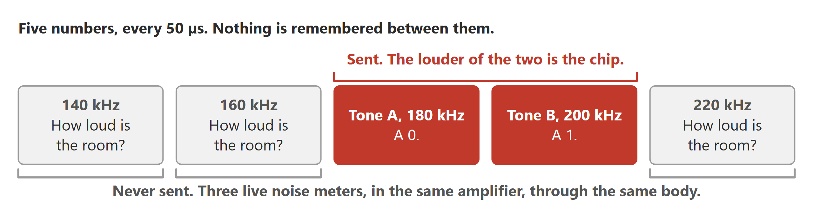
*Figure 6.4. What the band weighs: the two tones every 50 µs, the three room pitches every fourth. One tone is on the plate at a time, and here it is A.*

* **Two tones, not one.** 180 kHz and 200 kHz. Every 50 µs the band scores both and asks which is louder. That answer is one step of the message. A dry hand or a loose grip makes both quieter together, so the comparison still comes out right.
* **Three pitches nobody ever sends.** 140, 160 and 220 kHz, scored through the same amplifier and the same body as the tones. They are not a message. They are a live reading of how noisy the room is.
* **The middle of the three, not their average.** One stray signal landing on one of them cannot move the middle of three. Standard radar practice, not an invention.
* ***Is anybody there?* becomes one comparison.** Is the tone louder than that middle reading, by a set margin? The reading is an average, kept fresh over the length of one preamble, and averaging is safe here because nothing the band sends can land on those three pitches. The first radio averaged the tone's own pitch instead, and a long tone pulled the average up to meet it until the receiver went deaf. Appendix C.
* **The margin is computed, not tuned.** It comes from a sentence, *I will accept one moment a minute where the band thinks someone is there and nobody is*, and the arithmetic follows. Nobody turned a knob until the bench looked happy.
* **Two tones are never off.** With one tone, half the message is silence and carries nothing. With two, every step is a tone at the same peak voltage, so each bit arrives with about twice the energy, and nothing in the amplifier changed.

#### 6.6 From tones to bits

Three steps: weigh the pitches, read each bit, find where a frame starts.

##### 6.6.1 Weighing the pitches


*Figure 6.5. What the Goertzel filter replaces. Dashed: the parts the band does not have.*

There are two usual ways to hear a tone (Figure 6.5).

* **The full receiver** shifts it down with an oscillator and a mixer, then filters and amplifies it again.
* **It needs two mixers**, I and Q. The two bands run on separate clocks, so a tone arrives at any phase, and one mixer's output fades with the phase.
* **The simple receiver** is a diode and a capacitor, an envelope detector. Or a tone-decoder chip such as the LM567.
* **The band does all of it in software.** The converter samples the tones themselves, 500,000 times a second. A **Goertzel filter** turns every 25 samples into one number: how much of that pitch is there, at any phase. The band runs five of them: the two tones every window, and the three room pitches every fourth window.

**Better than the full receiver:**

* **Five parts gone:** the oscillator, two mixers, the filter and the second amplifier.
* **No mixer offset** drifting under the reading.
* **Five channels for the price of the parts of none.** Adding the three noise pitches added no hardware at all.

**Better than the simple receiver:**

* **A diode hears every pitch at once.** Mains hum, phone chargers and lights all count as signal.
* **The LM567 only says yes or no.** The band needs numbers, to tell which of two tones is louder.
* **The pitch never drifts.** The LM567's is set by a resistor and a capacitor. Goertzel's is set by the crystal clock.

**Why Goertzel and not an FFT.** Both measure frequencies. An FFT measures all of them, and the band needs five.

* **Five answers, not thirteen.** An FFT of 25 samples returns 13.
* **Sample by sample.** Goertzel updates two running numbers as each sample lands. There is no block to store, and the answer is ready with the 25th sample.
* **Any length.** A standard FFT wants 16 or 32 samples. At 32, these tones would fall between two answers and smear across both. 25 samples hold exactly nine and ten cycles of them, so each sits dead on one.
* **Cheap.** All five, plus the decision, cost about a fifth of one core, measured in the real firmware, with Bluetooth running on the other core.

##### 6.6.2 Reading each bit

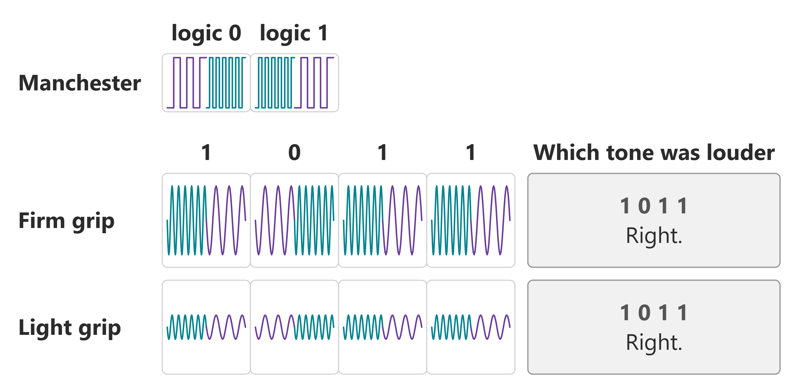
*Figure 6.6. The same four bits, through a firm grip and a light one. The key is the square wave the pin sends; the rows under it are what survives two bodies and the band's filters. The gap between the two pitches is drawn far wider than it is: they are really 180 and 200 kHz, a tenth apart.*

* **Each bit is two chips.** 180 kHz then 200 kHz is a 0; 200 kHz then 180 kHz is a 1. This is Manchester coding (Figure 6.6).
* **How much arrives changes** with grip and posture. It does not matter: the receiver never asks how loud, only which of the two was louder.
* **Every bit changes in the middle**, so the receiver never loses count.
* **The imbalance cancels.** Every bit carries one chip of each tone, so if one tone always arrives a tenth stronger, both halves of every bit carry that tenth. The band measures the imbalance anyway, on every frame, and reports it, but nothing corrects for it, because nothing needs to.
* **The cost is half the speed:** 2,000 bits a second.

##### 6.6.3 Finding where a frame starts

A card does not fit in one go, so it goes in frames. Figure 6.7 is one frame; section 6.7 is how the card is cut up.


*Figure 6.7. One frame, 156 ms. Each part keeps its colour in all three rows.*

* **The start is a landmark, not a count.** Some of the preamble is lost while the receiver wakes up, so it never counts chips. It looks for the one 00, then checks the seven chips after it.
* **Why the marker reads differently in the two rows.** 11110000 is the marker's eight *bits*. On the plate every bit is two chips, so those eight go out as sixteen, and the one place the alternation breaks is where the four 1s turn into the four 0s. That break is the 00, and the seven chips after it are what the receiver checks.
* **How strict that check is, is also computed.** From another sentence, *one false start per 24 hours of listening*, the receiver works out how clean the run in front of it has to be: 28 transitions out of 30.
* **No length field.** A length can itself arrive damaged. Every frame is the same size, and the header says how many frames make the card.

#### 6.7 The card is too big

* A vCard is nearly half common parts: `BEGIN:VCARD`, `TEL;TYPE=CELL`, `END:VCARD` (Figure 6.8).
* The link is slow. Sent as text, Rohit's card alone takes the whole second. Savithri's never gets a turn.


*Figure 6.8. A card like Rohit's, as text and packed.*

* **Packed (Figure 6.2, box 7):** labels become one-byte tags, digits go two to a byte, common email domains become one byte. 169 bytes becomes 79, and both cards fit.
* **Packed once, at the desk.** The band stores only the packed card, so a handshake has nothing left to do but send.
* **Savithri's band rebuilds it** (Figure 6.2, box 18) into a proper vCard before her phone sees it.


*Figure 6.9. Sent most important first. Nothing is ever asked for twice.*

* **Most important first:** name and number, then email, then the rest (Figure 6.9).
* **Never half a field.** Every frame reads on its own, so a number never arrives with the wrong label.
* **No asking again.** There is no time. A damaged frame fails its checksum and is dropped.
* **Whatever arrived goes to the phone.** If the hands part after frame 1, Savithri still gets his name and number. Without frame 1 she gets nothing.

**And one thing that looked right and was not.** The plan was to send frame 1 every other time (1, 2, 1, 3, 1, 2), spending half the airtime on the part that matters most.


*Figure 6.10. What the channel carries in a one-second handshake. The two bands take turns, three frames each.*

* A frame takes 156 ms. About six fit in a one-second handshake, shared between the two bands (Figure 6.10).
* Every repeat of frame 1 is a frame the other band already has. The frame it still needs never goes.
* Simulated over one-second handshakes: frame 1 every other time gives a complete card **0 %** of the time. Each frame once, in turn: both cards complete **every time**.
* **Fix: plain round robin.** 1, 2, 3, then round again. A brief touch still gets a name and a number, because round robin sends frame 1 first anyway. The order was what kept that promise; the repeating never did.

#### 6.8 Nothing says go

Nothing tells the band a hand has closed. Three parts: why waiting cannot work,
what the band does instead, and who speaks once the hands meet.

##### 6.8.1 Waiting does not work


*Figure 6.11. Being heard is the touch.*

* **No button, no accelerometer, no touch sensor.**
* **Quiet means nothing.** There is no channel until the hands meet, so an empty room and a hand in a hand sound exactly the same (Figure 6.11).
* **If every band waits to hear someone, no band ever speaks.**
* **Being heard is the touch.** Hearing another band is itself the proof, because there was no path until the hands met.

##### 6.8.2 So every band keeps beaconing

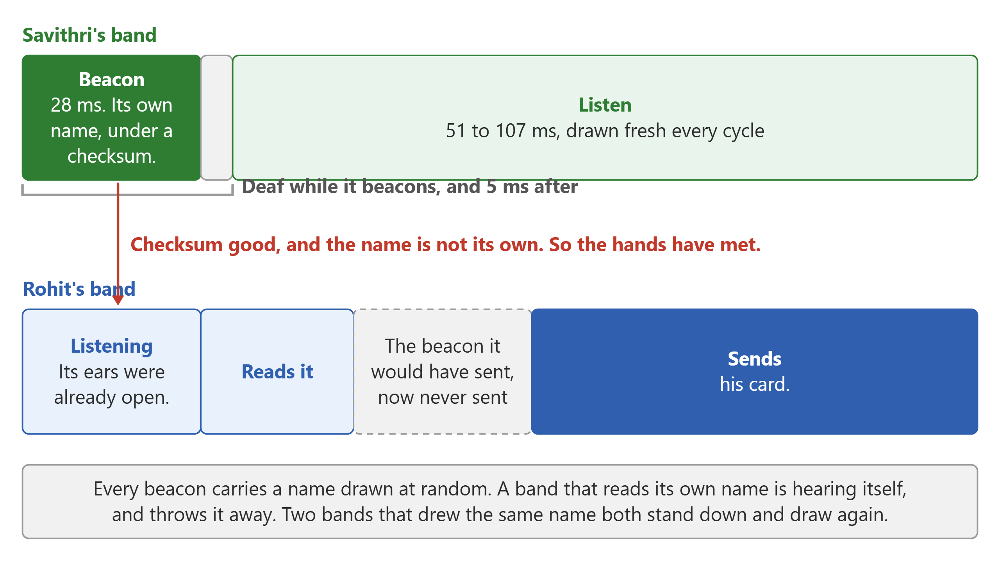
*Figure 6.12. One band's cycle, drawn to scale in time, and what happens when a hand closes on another wrist.*

* **Every band runs the same loop, all day:** beacon, then listen, then beacon again (Figure 6.12).
* **The beacon is a short frame** carrying a nonce, a number drawn at random and used once, under a checksum.
* **It never beacons over someone else.** The listening clock only runs while the channel is quiet, so a band that can hear anything at all remains silent.
* **Is that a peer?** The checksum passed, and noise almost never passes a checksum.
* **Is that me?** A band shuts its ears while it beacons, but an echo of its own beacon can still reach it a moment later. The nonce is what tells the two apart.
* **The listening period is drawn fresh every cycle.** On a fixed rhythm, two bands whose beacons clash would clash for ever.
* **How long it listens on average was worked out, not chosen:** listen too little and the beacons clash more often, listen too long and the hands part before the two bands have met. It works out at about three beacons' worth.
* **Two bands that drew the same nonce** both read it as their own, both stand down, and both draw again. It costs one cycle.

##### 6.8.3 The one that heard, sends


*Figure 6.13. Figure 6.12 zoomed out: the one that heard sends first, then one frame each, in turn.*

* **A band is deaf while it beacons, and for a moment after.** So a band that managed to read a beacon had not started one of its own (Figure 6.13).
* **At most one band can ever read the other.** There is nothing to elect, and no tie to break.
* **The reader goes first** (box 9 of Figure 6.2). It is the only one that knows a handshake has started.
* **The beaconer receives.** As far as it knows it spoke into an empty room, and its ears are already open when the frame arrives.
* **One frame each, then swap.** Not a whole card each. They alternate frame by frame, so a touch that ends early still leaves both ends with a name and a number.
* **One pad, one direction at a time.** Each band waits out the other end's recovery before it starts, so the far end is certainly listening.

### 7 The sequel

The pair works, and one handshake carries both cards. This is where it stands today, and what I would put into the next pair.

#### 7.1 The handshake

* **The band goes on the hand that shakes.** Worn on the other wrist, the card does not get through. I expected either wrist to work, and nothing in the design says otherwise. It simply turned out that way, and both wrists is a thing to win back.
* **A held clasp is what carries a card.** Both hands wrapped round, skin against skin, held until the LED flashes white and then goes green. The way the hands sit is what matters. The next pair should get the same result out of an ordinary shake.
* **Touch should be the only path.** Two bands brought within about 10 cm of each other complete a handshake with nobody holding either of them. That is not what I wanted: only the hand I shook should get my card. Further apart, on the bench, nothing gets through, so this is a near field leak.
* **The tones sit at the top of what this chip can read.** The Pico's converter samples at 500 kHz, which puts the ceiling at 200 kHz. I want to experiment with higher frequencies, and that needs a hardware update.

#### 7.2 The physical layer, rebuilt twice and open to a third

* **The first one switched a single tone on and off,** and taught me that off is never really off. Appendix C is that story.
* **The second sends two tones and asks only which is louder.** Worn, it is about twice as good as the first.
* **There are industry standards to learn from.** I am a beginner in this domain, and each version here answered the previous one's worst bug. Before writing a third, the right move is to study what industry already does for a channel like this and reuse it, instead of reinventing the wheel.

#### 7.3 The board

* **It was designed in two days,** because that is all the time there was. The board works. The next one needs more thought and more research behind every choice on it.
* **The button wants to be a right angle part.** The one fitted points straight up and the case needs it out of the side, so it was bent over and glued to the board. A right angle switch in the footprint settles it.
* **A surface mount RGB behind a diffuser is the cleaner answer.** The 5 mm through hole LED eats space inside the box, and a small part under a printed diffuser looks tidier from the outside.
* **The motor was meant to sit on the wall of the case,** so that the whole box buzzes against the wrist. The cheap coin motor's wires were short and stiff, and could not be used to hold it there, so it went onto double sided tape on the PCB instead. A surface mount motor soldered to the board answers the wires and the mounting together.
* **One port should program and charge.** Today the Pico's port programs, and the cell is charged on a separate TP4056 module, plugged into the board through a 2 pin JST-XH port and left outside the case. The charger belongs on the board.

#### 7.4 Power and size

* **There is a lot of sleep to win.** Both cores run flat out all day, one weighing five pitches twenty thousand times a second, the other on Bluetooth. Nothing is gated and nothing is clocked down when there is no hand anywhere near.
* **Battery life is the number to measure first.** I have not measured the current draw once, and on a 500 mAh cell a full show day is a guess. Measure it, then let the listening duty cycle set the life.
* **Watch sized is the target.** Today it is 45 × 65 × 25 mm on a 22 mm strap, which reads as a prototype strapped to an arm. To wear one into a meetup it has to be smaller.
* **Most of that volume is the Pico, and it is there for one reason.** PIO makes the tones and leaves the processor free. Move the tone and its reading into parts of their own, and a much smaller module does the rest, something like a Seeed XIAO ESP32S3, with the board shrinking around it.

#### 7.5 The app, and what to add to it

* **A pocketful of cards.** A band hands each card to the phone as it arrives. The next one keeps a whole day of them on the wrist, so the phone can stay in a bag all afternoon.
* **The band's own clock.** The meet time on a card today is when the card reached the phone, not when the hands met. If the phone was not connected at the time, the meet time is wrong. Give the band the time when it connects, and it can stamp the handshake itself.
* **Two cards.** A work card and a personal card, switched on the wrist with a long press, the LED saying which one is live.
* **An iPhone app.** The app today is Android only. The same app is needed for iPhone.
* **A reminder, two days later.** The app knows when you met. A quiet reminder to message the person, before the meeting is forgotten.

### 8 The end

The taxi pulled onto the flyover, and Rohit let his head fall back against the seat. He had made it. Just.

He was still smiling.

He had only meant to look in at one last stand on his way out. He had stayed half an hour. The man behind the table, Farhan, had hit the same problem Rohit had been fighting for three weeks, and had got round it a different way. They had leaned over the same board and argued it through, neither giving an inch. Rohit still thought Farhan's fix was wrong. But while he was arguing against it, he had finally seen what he had been missing. It had been in his own drawing all along.

He laughed at himself out loud, and the driver glanced at him in the mirror.

Both from Bengaluru, it turned out. They had come all the way to Hyderabad to meet.

Then he froze.

He had not got Farhan's number.

He went back through it in his head. The taxi calling. Running to the front desk. Pulling the band off his wrist and pushing it across to Savithri. "Flight!" "Go!"

And before that?

Before that, a quick handshake across the table, half a goodbye, already turning to go. Did the band buzz? He couldn't remember.

He opened the Handoff app. First in the list:

`Farhan Ansari`
`Met today, 5:02 pm`

Rohit let out a breath. The band was gone. Everything it had carried was still here.

He tapped the name and edited it to `Farhan Ansari (sparring partner)`. Then `Save to phone contacts`.

He opened a DM with him on WhatsApp.

`Hi Farhan, Rohit here. The one who said your fix would never work. Still don't think it will. Coffee next week, and you can try to convince me?`

Two blue ticks. Then `typing…`

`Knew it was you, I did save your number. Once I am back in the city I will raise an IRQ ;)`

His kind of people.

A connection was made.

### 9 The boards, from PCBWay

This is my first sponsored project. [PCBWay](https://www.pcbway.com/) manufactured the PCBs and shipped them to me. I only had to source the components.


*Figure 9.1. A bare board as it arrived, both sides.*

**It started with their email.** PCBWay wrote on 10 September offering to sponsor a project. The board didn't exist yet, and the Make a Connection contest deadline was 16 days away. I designed the board in two days and placed the order on Saturday.

**Their engineers were super helpful and prompt.**

* **The finish.** I had picked leaded HASL on the order form but asked for lead-free in the notes. Tori caught the mismatch that same Saturday and asked which one I meant.
* **The antenna.** Under the Pico's antenna there is a patch with no copper on either side. That's deliberate. To a fab it looks like a slot someone forgot to draw. Sophia asked me instead of guessing. Then she sent back the exact files they had received so I could check them against mine. It was settled the same morning.

**Speed.** The order went in on Saturday 12 September. Every question was closed by the next working day, Monday the 14th. Shipped by DHL on the 15th, and at my door on the 23rd. It would have been earlier: a glitch in the DHL portal would not let me upload my KYC, so customs clearance sat waiting. The 24 hour lead time and the fast shipping are what got this project finished inside the contest deadline.

**Quality.** I gave these pads a hard time. Surface mount and through hole, soldered and desoldered again and again, a vacuum pump and solder wick over the same joints many times. Not one pad lifted. On the breakout boards I usually buy, a pad comes away after two or three rework sessions. These took everything I did to them and still look like new.

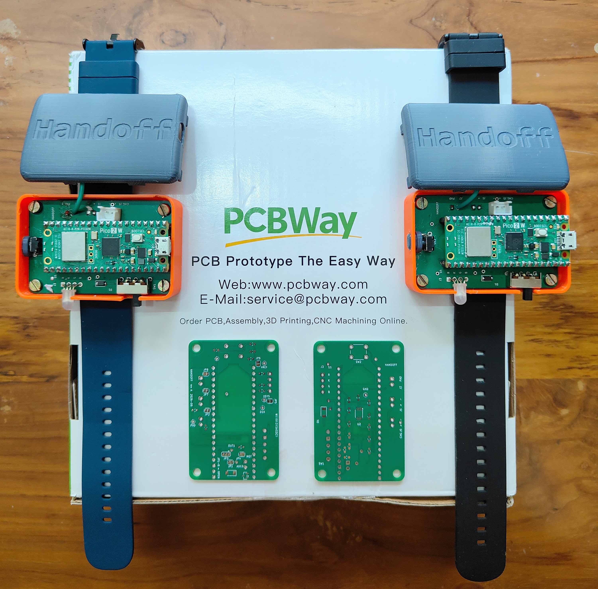
*Figure 9.2. The pair, finished, on the box they came in.*

**Serene**, in their marketing team, made the whole thing easy, from the first email to the order going through.

Thank you to PCBWay, and to Serene, Tori and Sophia, for backing my project.

If you want to build a pair yourself, appendix B has the board files ready to upload to PCBWay.

---

### Appendix A: Bill of materials

*The story ends above. Everything from here is reference.*

One band. Build two: a handshake needs a pair.

The supplier codes are [robu.in](https://robu.in/) and MakerBazar, because that is where these were bought; any equivalent part in the same package works. `hardware/bom.csv` and `hardware/README.md` in the repository carry the same list with the reasoning behind each choice, and with R1 and R2 still at the 1 MΩ they were designed as. See the note under the table.

**The board itself**

| What | Detail |
|---|---|
| Handoff PCB | Upload `hardware/build/handoff-pcbway.zip` to PCBWay. 40 × 62 mm, 2 layers, 1.6 mm, 1 oz copper. HASL is fine; ENIG is the one upgrade worth paying for, for flat pads under the amplifier's 0.65 mm pins. `hardware/build/order.md` answers every other question the order form asks, and lists what to check on their preview before you pay. The smallest run is five, which is the right number anyway: two bands and three spares. |

**On the board**

| Ref | Part | Package | Qty | Code |
|---|---|---|---|---|
| U1 | Raspberry Pi Pico 2 W | socketed, not soldered | 1 | R190344 |
| - | 2.54 mm 1×40 female header | cut into two 1×20 for the Pico | 1 strip | 555698 |
| U2 | MCP6292-E/MS dual op-amp, 10 MHz | MSOP-8 | 1 | R193529 |
| **R1, R2** | **100 kΩ**, the two electrode resistors | 0603 | 2 | 1481824519-20P |
| R3 | 1 MΩ, bias for the high-impedance node | 0603 | 1 | R134792 |
| R4, R6, R7, R10, R11, R17 | 100 kΩ | 0603 | 6 | 1481824519-20P |
| R5, R8, R15 | 10 kΩ | 0603 | 3 | 1481824531-20P |
| R9 | 1.5 kΩ | 0603 | 1 | R134878 |
| R12, R13, R14, R16 | 100 Ω | 0603 | 4 | 1860310035-20P |
| C1, C2 | 330 pF C0G/NP0 | 0603 | 2 | R136892 |
| C3 | 100 nF X7R | 0603 | 1 | R172322 |
| C4, C5 | 10 µF X5R, 25 V | 0603 | 2 | R144171 |
| C6 | 330 pF C0G. **Not fitted**, a spare footprint | 0603 | 0 | R136892 |
| D1, D3 | PMEG3020ER-TP (**Tech Public**, not Nexperia) | SOD-123FL | 2 | R241663 |
| Q1 | AO3400A N-channel MOSFET | SOT-23 | 1 | R209179 |
| SW1 | SS-12F23G5 slide switch, SPDT, right-angle | through-hole | 1 | R132611 |
| SW2 | Tactile push button, 6 × 6 × 5 mm | through-hole | 1 | 618182 |
| J1, J2, J5 | JST-XH 2.50 mm 2-pin male | through-hole | 3 | - |
| J3 | JST-XH 2.50 mm 4-pin male, or solder the LED straight in | through-hole | 1 | - |
| J6 | 2-pin 2.54 mm header, or solder the motor leads in | through-hole | 1 | - |

**Two values differ from the silkscreen, and this is the one place it matters.** The board and the repository BOM were laid out with R1, R2 and R3 all at 1 MΩ, which is what the design document asks for. What is fitted, and what every measurement in this post was taken with, is **R1 = R2 = 100 kΩ** and R3 = 1 MΩ. See B.1 for what that means for the person wearing it, and 5.4 for why 10 kΩ is not better still.

**Off the board**

| What | Detail | Qty |
|---|---|---|
| RGB LED, 5 mm, **common cathode** | its four legs are already in J3's hole order, so nothing crosses | 1 |
| Coin vibration motor, 10 mm, 3 V | leads solder into J6 | 1 |
| Li-ion cell, 1S 3.7 V, ~500 mAh | on a **2.50 mm JST-XH** plug, not the 2.00 mm JST-PH most cells ship with. It has to lie in a 45 × 65 mm box beside the board; the one used here is a 502030 cell, 30 × 20 × 5 mm | 1 |
| TP4056 charger module | stays outside the box | 1 |
| Single-sided copper-clad board | two 25 × 25 mm squares: the skin plate and the outer electrode | - |
| Clear packing tape | the insulation over the skin plate. Thinner couples better | - |
| Thin insulated wire | about 10 cm, for the two electrodes | - |

**The box**

| What | Detail |
|---|---|
| Printed halves | `hardware/enclosure/bottom.3mf` and `top.3mf`, about 45 × 65 × 25 mm together. PLA or PETG, 0.2 mm layers |
| M3 brass heat-set inserts, 5 mm | 4 |
| M3 screws to suit your inserts, typically 6-8 mm | 4 |
| Watch strap, 22 mm | 1 |

**Tools**

* A fine soldering iron, 0.5 mm solder, a flux pen, solder wick, tweezers and isopropyl alcohol.
* A magnifier, or a phone camera, for the amplifier chip. Its eight pins are the finest pitch on the board.
* A 3D printer, or a printing service.
* A multimeter with continuity, ohms, DC volts, AC volts and diode mode. **No oscilloscope is needed at any step.**
* **A laptop that runs on its own battery**, with Python 3, and a micro-USB cable.
* **Two Android phones**, 8.0 or newer, with Bluetooth and a camera.

---

### Appendix B: Build one yourself

* A handshake needs two bands, so build two.
* Each band pairs with one Android phone, so you need two phones as well.
* Everything is in the project repository, [github.com/rahuljeyaraj/Handoff](https://github.com/rahuljeyaraj/Handoff). Each step below names the file with the full detail.

#### B.1 Safety first

* **Battery only, both ends, whenever anyone is wearing one.** Never on a mains-powered laptop. A tethered reading is also a wrong reading: the USB lead joins the two bands' grounds through the PC, and that return path is the thing under test.
* **The skin plate is always covered.** Tape over the copper, edge to edge. No bare metal on skin.
* **Hand to hand only**, and **nobody with a pacemaker or an implanted defibrillator**.
* **Use the resistor values listed.** R1 and R2 at 100 kΩ hold the worst-case current through a person under **33 µA**, with the plate insulated on top of that. A person starts to feel current at about 1 mA at mains frequency, and that threshold climbs steeply with frequency, and these tones are at 180 and 200 kHz. The design document's rule is 1 MΩ, which would be ten times less current again; these bands are deliberately built at a tenth of that resistance, and the arithmetic above is the whole of the justification. If you would rather keep the original margin, fit 1 MΩ and expect a weaker link.
* **The outer electrode is tied straight to board ground with no series resistor.** It faces the room, not the arm, and it must stay that way round. Insulate it too.

Full rules: `docs/body-coupled-handshake-design.md`, section 13.

#### B.2 What you need

Appendix A, in full. Two things there are easy to get wrong and expensive to discover late: the **cell's plug** must be 2.50 mm JST-XH, and the **diodes** must be the Tech Public PMEG3020ER-TP in SOD-123FL, not the Nexperia part of nearly the same name in a different package.

<!-- TODO image 23-parts.jpg (Figure B.1): everything in appendix A, laid out on the bench for one band: the bare board, the Pico, the headers, the tape of 0603s, the LED, the motor, the cell, the TP4056, the two copper squares, the two printed halves and the strap. This is the picture a builder checks their own pile against. -->

#### B.3 Set up the PC

* **The repository.** Clone or download it first; every command below runs from its folder.
* **Firmware tools.** Install VS Code and its Raspberry Pi Pico extension. Open the repository folder and accept the SDK download. That installs the compiler and everything else the build needs.
* **Bring-up script.** Run `pip install pyserial`.
* **Prove it before you solder anything.** Hold BOOTSEL on a bare Pico, plug it in, and run `python scripts/bringup.py flash blink`. Its LED blinks once a second. That is the whole toolchain checked, on a board you have not yet spent an evening on.
* **App tools.** Install Android Studio, with a JDK 17 and the Android SDK at compileSdk 35. The app is not on a store: you build it and push it over the cable.

The root `README.md` covers the same, including Linux.

#### B.4 The order to build in

Nothing before the handshake needs the second band, so:

* **Take one board all the way,** through the meter checks, the plates, the box and its label. It is you, a multimeter and a USB cable, and it is most of the work.
* **Then build the second the same way.** From the outside they are identical, so label both as you go.
* **Then the handshake**, which is the first thing that needs two bands, two phones and two people.

One thing is easy to leave too late: the **plates** have to be made before the box closes, and the skin plate's wire is soldered to the board several steps earlier than that. `docs/hardware-bringup.md` runs in exactly this order: steps 0 to 11 on the bench, then P for the plates and the box, then 12 for the firmware, the label, the phone and the handshake.

#### B.5 Build the board

Follow `docs/hardware-bringup.md`, one step at a time. It has a drawing of each face.

* **Solder in three passes:** small parts on the top face, small parts on the bottom face, then the through-hole parts.
* **Check after every pass** with the meter. Each step lists what to measure and what it should read.
* **Fit 100 kΩ at R1 and R2**, not the 1 MΩ the silkscreen and the repository BOM name. R3 is 1 MΩ. Appendix A and B.1 are why.
* **The eight solder jumpers, JP1 to JP8, all start open.** Close each one only when its step says so. That way each block is proved before the next is joined to it.
* **Clean with isopropyl alcohol** after every pass, and let it dry. Flux left near the amplifier upsets it.
* **One script runs every powered check:** `scripts/bringup.py`. It flashes a test program, then switches the LED, the motor and the transmitter from the PC.

A few things there are easy to get wrong and hard to see:

* **The Pico's own pins.** The board takes the Pico in a socket, so a plain Pico needs its male header soldered on first.
* **JP8 is not a role strap you have to set.** Both bands run the same firmware and settle between themselves which one speaks first. It stays open on both.
* **One step touches the electrode**, and only one: step 9, where a fingertip on the wire proves the receiver by picking up mains hum. Run the laptop on its own battery for it, mains lead out. Every other step is done with nobody touching a plate.

The bench work ends at step 11, with the band running on its own cell and both directions of the signal path checked. What is left is the plates, the box and the firmware, in that order.

#### B.6 Plates, box and strap

Step P of the bring-up guide. This is the part that decides whether the band works on a wrist rather than on a bench.

<!-- TODO image 24-plate.jpg (Figure B.2): the bottom half open, seen from the side or in a cutaway: the taped skin plate on the outside against the wrist, then the board, then the cell, then the outer electrode facing up and away from the arm. The stacking order is the one thing in this appendix that words do badly. -->

**There are two electrodes, not one.** The skin plate is the signal. The outer one is the return path, and it is the difference between a link that dies after a few seconds and one that runs all day (6.4).

* **Solder the free end of the plate wire** to the copper side of one 25 × 25 mm square. The other end is already in the board's `PAD` hole: it went in during bring-up, as the bench electrode, and the plate is what it grows into.
* **Cover that copper completely** with one layer of clear packing tape, round the edges. Thinner tape couples better. This is the insulation the safety rules turn on.
* **Tape it to the outside of the bottom half**, taped face out, so it lies against the wrist.
* **The second square is the outer electrode.** One wire, exactly one and never two, from its copper to **J2 pin 2**, which is board ground. It mounts inside the top of the box, facing the room, with the board and the cell between it and the skin plate. The two must never end up back to back: at close spacing they short to each other instead of the outer one coupling to the room.
* **Press the four brass inserts** into the bottom half's posts with the soldering iron, then screw the board down.
* **Cell into the battery socket.** Check the plug first: the square pad is minus. Charge it on the TP4056 before the first run.
* **Charger:** TP4056 `OUT+` and `OUT-` to the charge socket. It is wired before the switch, so the cell charges with the band switched off, and the module stays outside the box.
* **Fit the top half and the 22 mm strap**, and slide the switch to the position you marked during bring-up. The label comes later, in B.7: the band has to be running the real firmware before it will tell you what to put on it.

The box is an **initial design**, and it is honest to say so. Dry-fit it: hold the board in place and check every opening against your own parts (the USB socket, the switch handle, the button, the LED, and the way the two electrode wires and the charger lead get out) before any screw goes in. A hole is easier to open with a knife than to close.

#### B.7 The real firmware, and the band's label

Both bands get the same image. There is no transmitter one and no receiver one; they settle that between themselves over the link.

```
python scripts/bringup.py flash handoff
```

At boot the LED flashes white and the motor taps once. Then the band tells you its name, and that is where the label comes from: four hex digits, printed as a QR code or simply typed into the app.

* With the band on USB, run `python scripts/bringup.py watch` and power-cycle it. The banner prints a line like `name "Handoff band 7A3C", label 7A3C`.
* For a sticker: `pip install "qrcode[pil]"`, then `python tools/band_label.py 7A3C`. That writes `band-7A3C.png`, the QR code with the four characters under it. Print it about 20 mm square; smaller and a phone stops reading it at arm's length.
* Or write the four digits on the band with a marker. The app takes them typed.
* **Two bands, two codes.** Label both before they get mixed up.

Nothing in the build sets a frequency, a threshold or a role. The tones, the clock, the noise gate and the hunt are all either fixed by the hardware or computed from the requirements when the firmware is built.

#### B.8 Install the app

* Open the `android` folder in Android Studio.
* Turn on USB debugging on the phone and plug it in.
* Press Run.
* Then do it again for the second phone.

`android/README.md` has the command-line route.

#### B.9 Pair and set up

The same steps Rohit took at the desk in chapter 3, once per band. Figure 4.4 is what each light means.

* **Switch the band on.** A slow blue pulse means it is waiting for a phone.
* **In the app, tap `Pair a band`** and scan the label, or type the four digits. Android asks you to confirm one device.
* **Set up your contact card** and tap `Save`. The band blinks green twice.
* **One band, one phone.** A band that already belongs to a phone will not pair with another. Hold its button for five seconds and it forgets its phone and its card, and pulses blue again, which is also how you hand a band to someone else.

#### B.10 The first handshake

<!-- TODO image 25-band.jpg (Figure B.3): a finished band worn on a wrist, strap on, label showing. The first photograph of the actual thing in the post; everything before this is drawings and bare boards. -->

**Prove the pair on the bench first**, which needs nobody but you: both bands on USB with a console each, held back to back so the two taped plates touch, and a `done` line appears on both. That shows both bands are alive and can complete an exchange. It does not prove coupling, because two bands on one laptop already share a ground. The wrist is what proves coupling.

Then, for real:

* Two people, one band each, skin plate against the wrist.
* **Both bands on their own cells, USB out of both.** That is the safety rule, and it is also the only way the link works.
* Both phones paired, each band carrying its owner's card, both phones nearby. The app does not need to be open.
* **Shake hands**, a normal firm grip, for about a second.
* Each band flickers white while the cards cross, then turns green and buzzes.
* Each name is now in the other person's app.
* **Keep the two bands apart when you are not deliberately shaking hands.** Not for safety, but as proof. At hand spacing with nobody touching, the link carries nothing at all, and that is the measurement that says it is the body and not the air.

#### B.11 If something goes wrong

* **The build fails before it reaches the board.** That is the Pico SDK, not your soldering. Prove it on a bare Pico, as in B.3.
* **The Pico does not show up on USB.** Hold its BOOTSEL button while you plug it in, then flash again.
* **`bringup.py` says there is more than one Pico.** The other band is plugged in too. Unplug it, or pass `--port`.
* **The app cannot find the band.** Check the four digits against the banner, and type them instead of scanning. Turn the phone's Bluetooth off and on again. If the band was ever paired to another phone, hold its button for five seconds first.
* **Both bands work alone, but a handshake does nothing.** USB out of both, plates against skin, and hold the grip a full second.
* **The link works for a few seconds and then dies.** The outer electrode: missing, wired with two wires instead of one, or sitting back to back with the skin plate (B.6).
* **One band does everything and the other nothing.** They run the same firmware, so suspect the quiet one's receive path and re-run the step that listens for mains hum.
* **Anything during bring-up.** The table at the end of `docs/hardware-bringup.md` lists each symptom and where to look.

---

### Appendix C: The first radio, and what it taught

The bands in chapter 6 are the second design. The first one worked, exchanged real cards through real people, and was then deleted. It is written down here because its mistakes are ones anybody building this would make, and because the reasoning that replaced it only makes sense against what it replaced.

#### C.1 One tone, switched on and off

* A single 200 kHz square wave on the pad. Gated on for a mark, off for a space. On-off keying.
* One Goertzel filter, on that one pitch. Everything in 5.6 about Goertzel against a mixer, a diode or an FFT was true then too, and survives unchanged, with one filter instead of five.
* **Manchester, the same as now**, but each bit was tone-then-silence or silence-then-tone.


*Figure C.1. The same four bits, through a firm grip and a light one, under the first radio.*

* **Comparing the two halves was already right.** A fixed threshold reads the firm grip and misses the light one; the louder half is the same answer for any grip (Figure C.1). That idea carried straight over; only what is in the two halves changed.
* **What did not carry over is everything else.** Presence, rendezvous, and the preamble hunt all had to judge a single stream of loudness against a remembered level, because with one tone there is nothing else to compare it to (C.3).

#### C.2 Off is not low

This one was caught by working through the circuit, before the amplifier was built, and it is the mistake most worth passing on.

* The tone is switched on and off. At first, *off* meant holding the pin at 0 V.
* Zero is zero. It looked harmless.
* But a band has one pad, for sending and for listening, and the pad is wired to the band's own amplifier.
* Holding it low pulled that amplifier to the bottom of its range. Every frame did it, over and over.
* When the frame ended, the amplifier took **17 ms** to recover. The budget for turning round is **1 ms**.
* So every frame a band sent left it deaf, just when the other band's frame was due (Figure C.2).


*Figure C.2. What a band does to itself when the tone is off.*

* **Fix: off means let go.** The pin is released, not held. The pad rests in the middle, and the amplifier never notices a frame going out.
* **One capacitor between the two amplifier stages made smaller**, as a backstop. Any jolt that still gets through is gone in a fraction of a millisecond.
* The other band gains too. A held-low *off* put a step on the pad thirty times bigger than the tone, and the body carried it across. A released pad sends nothing.
* **And the whole problem is gone now**, which is the part worth noticing. Two tones are never off, so there is no step to recover from and nothing to release. What replaced 17 ms of amplifier recovery is 5 ms of the converter's own pipeline draining: measured, not estimated, and it does not grow with the length of what was sent.

#### C.3 The floor, and the three fixes that did not fix it

* Presence was *level against a tracked floor*: busy at three times the floor, or the floor plus 24 counts, whichever was larger.
* The floor climbed until it was more than half the signal it was supposed to be measuring, and then the detector was deaf.
* Three redesigns of the floor were written. Each was a real improvement. None of them worked, because a floor is what a featureless tone forces on you: the fault was one layer down from where the fixing was happening.
* Deleting the file was cheaper than the fourth attempt. `carrier.c` has no successor: the three noise pitches in 5.5 are not a better floor, they are a measurement taken at the same instant as the signal.

#### C.4 The rendezvous, before it had a nonce in it

* A band announced itself with a flat 10 ms tone, then recovered, then listened for a random time, then went round again.
* *Is that a peer?* It outlasted 9 ms. *Is that me?* My ears were shut, probably. *Who sends?* Whoever heard first.
* Four bugs came out of that in one afternoon: a band hearing its own shout; any carrier at all read as a peer; a preamble sent into a peer that was still deaf; and a receive turn walking away mid-frame as the floor climbed underneath it.
* **The idea underneath it was right and is unchanged.** Being heard is the touch; the hearer sends; the shouter receives. Figures 5.11 to 5.13 are still that argument. What changed is that the shout became a frame with a nonce in it, so all three questions became arithmetic instead of timing.

#### C.5 The one that was never built

* The plate and the skin make a capacitor. Add one inductor, tuned to the carrier, and the two resonate.
* On paper, **20 to 30 dB** more signal, for one cheap part. Very tempting, with so little getting through.
* But a resonance only builds up when little is lost along the way, and this link loses a great deal on purpose, to keep the wearer safe. The same loss flattens the resonance before it can build.
* Left out. Written down twice, here and in 5.4, so nobody tries it a third time.
